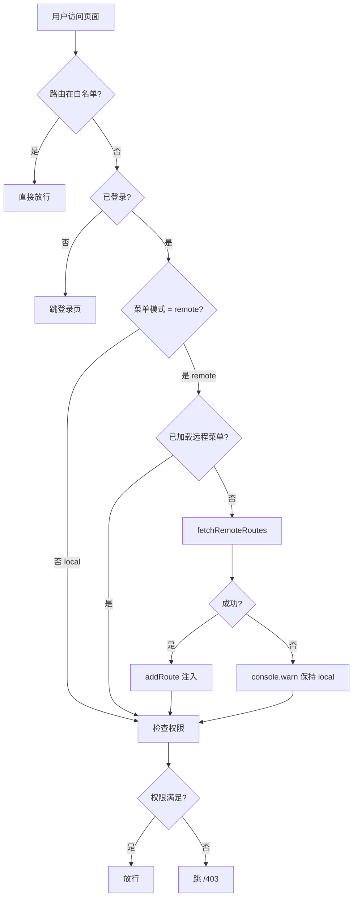

# 路由模块设计

> **文档版本**：v1.0.0 | **最后更新**：2026-07-21
> **覆盖范围**：菜单加载方式（local / remote）、白名单体系、组件注册表、远程菜单 JSON 格式、新增路由流程

---

> ✅ Sidebar 菜单渲染已在 v3 实现（2026-07-24）：从 `router.getRoutes()` 自动派生 + 多级递归 + i18n 标题解析 + 折叠态联动。详见 `src/layouts/default/components/Sidebar.vue`（348 行，含设计取舍注释）与 `docs/audit/2026-07-24-v3-usability-review.md` §1.1 P0-1。

---

## 📋 架构总览

```
src/
├── modules/                              # 业务模块（关注点分离）
│   ├── auth/
│   │   ├── views/Login.vue
│   │   └── routes/index.ts               # ← 本模块路由声明（自动注册）
│   ├── home/
│   │   ├── views/Index.vue
│   │   └── routes/index.ts
│   ├── user/
│   │   ├── views/List.vue
│   │   └── routes/index.ts
│   └── error/                            # 错误页（含 catch-all 404，必须手动注册）
│       ├── views/
│       └── routes/index.ts
└── router/
    ├── index.ts                          # 入口：自动注册 + fallback + 守卫
    ├── auto-register.ts                  # import.meta.glob 扫描各模块 routes/ + 派生 COMPONENT_REGISTRY
    ├── fallback.ts                       # catch-all 404 兜底（单独注册避免字典序问题）
    ├── config.ts                         # 路由全局配置（菜单模式）
    ├── whitelist.ts                      # 路由 name 白名单
    ├── types.ts                          # RouteName 联合类型 + RemoteMenuItem 协议
    ├── remote.ts                         # 远程菜单加载 + JSON → RouteRecordRaw 转换
    └── guards/
        └── auth.ts                       # 白名单 + 登录态 + 远程加载 + 权限校验
```

> **为何 catch-all 404 单独注册**：`auto-register.ts` 用 `import.meta.glob` 按字典序扫描，`error` 模块在 `user` 之前。若 catch-all 路由放 error 模块，匹配时会先于 `/user/list`，导致用户页被错误拦截。因此 catch-all 抽到 `router/fallback.ts` 单独注册。

### 错误页模块拆分

| 模块                              | 路由                                | 注册方式                 |
| --------------------------------- | ----------------------------------- | ------------------------ |
| **具名错误页**（403 / 404 / 500） | `src/modules/error/routes/index.ts` | 自动注册                 |
| **catch-all 404 兜底**            | `src/router/fallback.ts`            | 全局手动注册（保证最后） |

### 四层职责

| 层         | 文件                                                                                             | 职责                                                                         |
| ---------- | ------------------------------------------------------------------------------------------------ | ---------------------------------------------------------------------------- |
| **业务层** | `src/modules/<feature>/routes/index.ts`                                                          | 每个业务模块自己声明路由（关注点分离）                                       |
| **配置层** | `router/config.ts`                                                                               | 决定菜单加载模式（local / remote）                                           |
| **定义层** | `router/types.ts`                                                                                | 路由 name 集中定义（`COMPONENT_REGISTRY` 由 `router/auto-register.ts` 派生） |
| **运行层** | `router/auto-register.ts` + `router/whitelist.ts` + `router/remote.ts` + `router/guards/auth.ts` | 自动扫描 + 白名单 + 远程加载 + 守卫执行                                      |

---

## 🔄 菜单加载流程



---

## 🎛️ 菜单加载模式

### 模式选择（src/router/config.ts）

```ts
export const ROUTER_CONFIG = {
  source: resolveMenuSource(),
}
```

| 命令                                  | mode     | 说明                                             |
| ------------------------------------- | -------- | ------------------------------------------------ |
| **`pnpm dev`**（默认）                | `remote` | 默认走接口菜单（贴近生产，强制走 mock 或真接口） |
| **`pnpm dev:local`**                  | `local`  | 切换到本地静态菜单（无需接口即可启动）           |
| **`pnpm build`** + **`pnpm preview`** | `remote` | 生产构建默认走接口                               |

### 切换 local 模式

```bash
# 命令行切换（推荐）
pnpm dev:local

# 或手动设环境变量（在 .env.development 添加）
VITE_MENU_SOURCE=local

# 或临时切换
VITE_MENU_SOURCE=local pnpm dev
```

> **实现位置**：`resolveMenuSource()` 读取 `import.meta.env.VITE_MENU_SOURCE`，未设置时默认 `remote`。
> **dev:local 实现**：`package.json` 中的 `dev:local` script 通过 `cross-env VITE_MENU_SOURCE=local vite` 自动注入环境变量。

### 模式对比

| 维度     | local 模式          | remote 模式                      |
| -------- | ------------------- | -------------------------------- |
| 启动依赖 | 无                  | 需后端 `/api/menu` 返回正确 JSON |
| 权限粒度 | 路由 meta 静态声明  | 后端按角色过滤可见菜单           |
| 新增路由 | 修改代码 + 重新部署 | 后端修改菜单 JSON                |
| 适用阶段 | 开发期 / 演示版     | 生产环境                         |

---

## 🔓 白名单体系（按路由 name）

### 设计决策：为什么按 name 而不是 path？

| 维度           | 按 path 匹配             | **按 name 匹配（采纳）** |
| -------------- | ------------------------ | ------------------------ |
| 路由 path 变化 | 白名单失效               | name 不变，白名单仍生效  |
| 类型安全       | 字符串拼写错误 TS 难发现 | `RouteName` 联合类型约束 |
| 后端注入路由   | path 不可控              | name 在前端注册表内可控  |
| 通配符支持     | 需正则                   | 仅枚举，集合查询 O(1)    |

### 白名单路由（src/router/whitelist.ts）

```ts
export const ROUTE_WHITE_LIST: ReadonlySet<RouteName> = new Set<RouteName>([
  'Login', // 登录页
  'Forbidden', // 403 无权限
  'NotFound', // 404 页面
  'ServerError', // 500 页面
])
```

### 业务路由加入白名单

例如：让"预览页"（任何人可访问，无需登录）加入白名单：

```ts
// 1. 在 router/types.ts 追加 RouteName
export type RouteName =
  'Login' | 'Home' | 'UserList' | 'Forbidden' | 'NotFound' | 'ServerError' | 'Preview'

// 2. 在 router/whitelist.ts 加入白名单
export const ROUTE_WHITE_LIST: ReadonlySet<RouteName> = new Set<RouteName>([
  'Login',
  'Forbidden',
  'NotFound',
  'ServerError',
  'Preview', // ← 跳过登录 + 权限
])

// 3. 在 modules/preview/routes/index.ts 定义路由
// 完成 —— 路由自动可用，remote 模式自动可用（component 由 auto-register.ts 派生）
```

### 判定函数

```ts
isWhiteListed(to.name) // 返回 boolean
```

在守卫中调用，命中即跳过所有检查（登录、权限、远程加载）。

---

## 📦 组件注册表（auto-register.ts 派生）

> ⚠️ 旧版的 `src/router/component-registry.ts` 已删除。`COMPONENT_REGISTRY` 现在由 `src/router/auto-register.ts` 从 `autoRegisteredRoutes` 递归提取 `(name, component)` 派生，**新增业务路由从 3 处改动降为 1 处**（routes/index.ts 写一次即可）。

```ts
// src/router/auto-register.ts 片段（实现细节）
export const COMPONENT_REGISTRY: Record<string, () => Promise<unknown>> = (() => {
  const map: Record<string, () => Promise<unknown>> = {}
  const visit = (routes: RouteRecordRaw[]): void => {
    for (const route of routes) {
      if (route.name && route.component) {
        const name = String(route.name)
        if (map[name]) {
          console.warn(`[router/auto-register] 重复的路由 name: ${name}（后注册会覆盖）`)
        }
        map[name] = route.component as () => Promise<unknown>
      }
      if (route.children?.length) visit(route.children)
    }
  }
  visit(autoRegisteredRoutes)
  return map
})()
```

### 为什么需要这个映射？

| 方案                         | 优点                        | 缺点                                                      |
| ---------------------------- | --------------------------- | --------------------------------------------------------- |
| 后端返回 component 路径      | 实现简单                    | 泄露前端源码结构（如 `/src/modules/user/views/List.vue`） |
| 后端返回 key + 前端映射表    | **安全 + 类型约束**（采纳） | 需前端维护映射表                                          |
| 后端返回 path + 前端静态注册 | 不泄露                      | 后端要懂前端路由                                          |

**采纳**：后端只返回业务路由 name + 路径 + meta，组件路径在前端 `COMPONENT_REGISTRY` 维护。TS 联合类型保证拼写错误立即报错。

---

## 🌐 远程菜单 JSON 格式

后端 `/api/menu` 接口返回（与 `src/router/types.ts` 中 `RemoteMenuItem` 协议一致）：

```json
[
  {
    "name": "Home",
    "path": "/home",
    "meta": {
      "title": "首页",
      "icon": "odometer",
      "requiresAuth": true
    }
  },
  {
    "name": "UserList",
    "path": "/user/list",
    "meta": {
      "title": "用户管理",
      "icon": "user",
      "requiresAuth": true,
      "permissions": ["user:view"]
    }
  },
  {
    "name": "UserDetail",
    "path": "/user/detail/:id",
    "meta": {
      "title": "用户详情",
      "requiresAuth": true,
      "permissions": ["user:view"],
      "hidden": true
    },
    "children": []
  }
]
```

### 字段说明

| 字段               | 必填 | 说明                                         |
| ------------------ | ---- | -------------------------------------------- |
| `name`             | ✅   | 业务路由名，对应 `COMPONENT_REGISTRY` 的 key |
| `path`             | ✅   | 路由 path（支持动态参数如 `:id`）            |
| `meta.title`       | 推荐 | 菜单标题（侧边栏 / 面包屑）                  |
| `meta.icon`        | 推荐 | 菜单图标（Element Plus icon 名）             |
| `meta.permissions` | 可选 | 权限数组，匹配 `userStore.permissions`       |
| `meta.hidden`      | 可选 | 是否在菜单中隐藏（但路由仍可访问）           |
| `children`         | 可选 | 多级菜单嵌套                                 |

### 失败回退（已在 remote.ts 实现）

```ts
export async function fetchRemoteRoutes(): Promise<RouteRecordRaw[]> {
  try {
    const menu = await menuApi.getMenu()
    return convertMenu(menu)
  } catch (err) {
    console.warn('[router/remote] 接口加载菜单失败:', err)
    return [] // ← 返回空数组，由守卫决定 fallback
  }
}
```

守卫行为：`fetchRemoteRoutes()` 返回空数组时 `console.warn` + 保持 local 菜单（不阻塞用户）。

---

## ➕ 新增路由的标准流程

### 0️⃣ Layout 选择速查（创建页面之前先决定）

业务模块路由的 **第一层** 节点（path = `/xxx`）必须指定 layout。本项目提供 2 套：

| Layout      | 组件路径                      | 视觉特征                                                  | 适用场景                                       | 白名单？            |
| ----------- | ----------------------------- | --------------------------------------------------------- | ---------------------------------------------- | ------------------- |
| **default** | `@/layouts/default/index.vue` | 左侧 Sidebar (#001529) + 顶 Header + 主内容区（CSS Grid） | 业务页面（仪表盘 / 列表 / 表单等需导航的场景） | 通常 false          |
| **blank**   | `@/layouts/blank/index.vue`   | 无侧栏、无顶栏，居中背景 #f5f7fa                          | 登录页 / 注册页 / 第三方回调 / 引导页          | 通常 true（白名单） |

> **典型搭配**：
>
> - 业务页（首页 / UserList / Orders）：`/home` 等 → `default`
> - 登录页：`/login` → `blank` + 加白名单
> - 错误页：`/403` `/404` `/500` → 用具名错误页（**不挂 layout**，参考 `src/modules/error/routes/index.ts`）

### 1️⃣ 定义视图组件

放在 `src/modules/<feature>/views/<PageName>.vue`：

```vue
<!-- src/modules/order/views/List.vue -->
<script setup lang="ts">
// 业务逻辑放这里
</script>

<template>
  <div>订单列表</div>
</template>
```

### 2️⃣ 在 `types.ts` 追加 RouteName

```ts
// src/router/types.ts
export type RouteName =
  | 'Login'
  | 'Home'
  | 'UserList'
  | 'OrderList' // ← 新增
  | 'Forbidden'
  | 'NotFound'
  | 'ServerError'
```

### 3️⃣ 在业务模块的 `routes/index.ts` 声明路由

业务模块新增路由**无需修改 `src/router/` 任何文件**，`auto-register.ts` 会自动扫描本文件并注册。

#### 模板 A：default layout 业务页（最常见）

```ts
// src/modules/order/routes/index.ts（新建文件）
import type { RouteRecordRaw } from 'vue-router'

const routes: RouteRecordRaw[] = [
  {
    path: '/order',
    component: () => import('@/layouts/default/index.vue'), // ← default layout
    children: [
      {
        path: 'list',
        name: 'OrderList',
        component: () => import('../views/List.vue'),
        meta: {
          title: '订单管理',
          icon: 'list',
          requiresAuth: true, // 默认需要登录
          permissions: ['order:view'], // AND 语义，全部满足才放行
        },
      },
    ],
  },
]

export default routes
```

#### 模板 B：blank layout 登录页

```ts
// src/modules/auth/routes/index.ts
const routes: RouteRecordRaw[] = [
  {
    path: '/login',
    component: () => import('@/layouts/blank/index.vue'), // ← blank layout
    children: [
      {
        path: '',
        name: 'Login',
        component: () => import('../views/Login.vue'),
        meta: { title: '登录', requiresAuth: false },
      },
    ],
  },
]
```

> blank layout 页通常加白名单（步骤 4），否则未登录用户会被守卫拦到登录页 → 死循环。

#### 模板 C：动态路由参数（`:id`）

```ts
{
  path: 'detail/:id',
  name: 'OrderDetail',
  component: () => import('../views/Detail.vue'),
  meta: { title: '订单详情', permissions: ['order:view'] },
}
```

视图组件取参：

```vue
<script setup lang="ts">
import { useRoute } from 'vue-router'
const route = useRoute()
const orderId = route.params.id // string 类型
</script>
```

类型安全跳转：

```ts
await pushByName('OrderDetail', { id: '123' })
```

#### 模板 D：多级菜单（嵌套 children）

一级菜单挂载 layout，二级页面写在 children 数组里。

```ts
{
  path: '/orders',
  component: () => import('@/layouts/default/index.vue'),
  meta: { title: '订单管理', icon: 'list' }, // 一级菜单 meta（显示在 sidebar）
  children: [
    {
      path: 'list',
      name: 'OrdersList',
      component: () => import('../views/List.vue'),
      meta: { title: '订单列表', permissions: ['orders:view'] },
    },
    {
      path: 'detail/:id',
      name: 'OrdersDetail',
      component: () => import('../views/Detail.vue'),
      meta: { title: '订单详情', permissions: ['orders:view'], hidden: true }, // ← 详情页菜单隐藏
    },
  ],
}
```

#### 模板 E：i18n titleKey（推荐用于多语言项目）

```ts
meta: {
  titleKey: 'menu.orders.list', // 优先走 i18n.t()，fallback 到 title
  title: '订单列表',             // i18n 不可用时的兜底
  icon: 'list',
  requiresAuth: true,
}
```

视图里设置 document.title：

```ts
import { useI18n } from 'vue-i18n'
import { useAppRouter } from '@composables/useRouter'

const { pushWithTitle } = useAppRouter()
const { t } = useI18n()
const title = t(meta.titleKey ?? meta.title)
document.title = title
```

> 也可以用 `pushWithTitle({ name: 'OrderList' })` 让 composable 自动设置 document.title（详见 `src/composables/useRouter.ts`）。

### 4️⃣ （可选）加入白名单

仅当路由需**跳过登录 + 权限校验**时（如登录页、预览页、错误页）：

```ts
// src/router/whitelist.ts
export const ROUTE_WHITE_LIST: ReadonlySet<RouteName> = new Set<RouteName>([
  'Login',
  'Forbidden',
  'NotFound',
  'ServerError',
  // 'Preview', // ← 业务路由加白名单（任何人可访问，无须登录）
])
```

### 5️⃣（可选）按钮级权限：路由 + v-auth 双层防护

路由守卫拦截**页面级**访问，组件内 `v-auth` 拦截**按钮级**操作。

```vue
<!-- views/List.vue -->
<script setup lang="ts">
import { useAuth } from '@composables/useAuth'
const { hasPerm } = useAuth()
</script>

<template>
  <!-- 单权限 -->
  <el-button v-auth="'order:edit'">编辑</el-button>

  <!-- 多权限 AND -->
  <el-button v-auth="['order:view', 'order:edit']">复合操作</el-button>

  <!-- 多权限 ANY + disabled（无权限时禁用按钮而不隐藏） -->
  <el-button v-auth:any.disabled="['order:edit', 'admin']">任一权限</el-button>

  <!-- TS 中也可用 hasPerm 函数式判断 -->
  <el-button v-if="hasPerm(['order:delete'])">删除</el-button>
</template>
```

### 6️⃣（可选）keepAlive / breadcrumb 控制

```ts
meta: {
  keepAlive: true,    // 列表页常用，缓存组件实例
  breadcrumb: false,  // 详情页常用，不显示面包屑
}
```

### ✅ 完成度自检

新增路由后跑一次 `pnpm check:routes` 自动校验：

```bash
pnpm check:routes
# ✓ 所有路由检查通过（declaredNames ≡ implementedNames）
```

5 个校验覆盖：

- A. whitelist ⊆ declaredNames
- B. declaredNames ⊆ implementedNames（声明必有实现）
- C. implementedNames ⊆ declaredNames（实现必声明）
- D. 系统路由必在白名单
- E. 双向一致性最终汇总

### local 模式 vs remote 模式

| 模式       | 路由来源                                                            | 新增路由流程             |
| ---------- | ------------------------------------------------------------------- | ------------------------ |
| **local**  | `src/modules/**/routes/index.ts` 自动注册                           | 步骤 1-6 全部完成即可    |
| **remote** | `src/modules/**/routes/index.ts`（兜底）+ 后端 `/api/menu` 动态注入 | 步骤 1-6 + 后端菜单 JSON |

> **关键差异**：remote 模式下，即便前端没写 `routes/index.ts`，只要后端返回对应 `name` + 路径 + meta，路由仍可用。但建议前端仍保留 `routes/index.ts` 作为"已知路由清单"，便于类型约束与代码可读性。

> **关于 component-registry**：原 `src/router/component-registry.ts` 已合并到 `src/router/auto-register.ts`，`COMPONENT_REGISTRY` 由自动扫描到的 `autoRegisteredRoutes` 派生。因此新增业务路由从"types.ts + component-registry.ts + routes/index.ts" 三处改动降为"types.ts + routes/index.ts" 两处，`scripts/check-routes.ts` 也同步移除 component-registry 校验项。

---

## 🛡️ 路由守卫拆分（src/router/guards/）

5 段守卫拆为独立可测纯函数 + 编排器，便于单测覆盖与未来扩展。

```
src/router/guards/
├── auth.ts           # 编排入口：setupAuthGuard + resetAuthGuardState（re-export）
├── visibility.ts     # 1️⃣ 可见性检查（meta.visible=false → /404）
├── login.ts          # 2️⃣ 登录态检查（未登录跳 /login + redirect query）
├── remote-menu.ts    # 3️⃣ 远程菜单加载（dynamicLoaded 状态机 + resetAuthGuardState）
├── permission.ts     # 4️⃣ 权限码检查（meta.permissions AND 语义 → /403）
└── composable.ts     # composeGuards 串接多个 guard（koa-style middleware chain）
```

### 编排顺序

```ts
// src/router/guards/auth.ts
router.beforeEach(async (to) => {
  // 0. 白名单：直接放行
  if (isWhiteListed(to.name)) return true

  // 1-5. 串接检查：任一返回 RouteLocationRaw 即终止
  return (
    (await composeGuards(to, [
      (r) => checkVisibility(r),
      (r) => checkLoginState(r, userStore),
      (r) => ensureRemoteMenuLoaded(r, userStore, routerStore, router),
      (r) => checkPermission(r, userStore),
    ])) ?? true
  )
})
```

### 单元测试入口

每个 guard 独立导出 → 独立 spec：

- `guards/visibility.spec.ts`（4 用例）
- `guards/login.spec.ts`（mock localStorage + fetchProfile 成功/失败）
- `guards/remote-menu.spec.ts`（mock fetchRemoteRoutes 行为）
- `guards/permission.spec.ts`（AND/ANY/边界）
- `guards/composable.spec.ts`（错误吞并 + 短路）
- `guards/auth.spec.ts`（含 resetAuthGuardState 3 用例）

---

## 🔐 按钮级权限（useAuth + v-auth + v-permission）

三件套覆盖按钮级 + 路由级权限。

```vue
<script setup lang="ts">
import { useAuth } from '@composables/useAuth'
const { hasPerm, hasAnyPerm } = useAuth()
</script>

<template>
  <!-- 单权限 -->
  <el-button v-auth="'user:edit'">编辑</el-button>

  <!-- 多权限 AND -->
  <el-button v-auth="['user:view', 'user:edit']">复合权限</el-button>

  <!-- 多权限 ANY + disabled 修饰符 -->
  <el-button v-auth:any.disabled="['user:edit', 'admin']">任一权限</el-button>

  <!-- TS 中也可用 hasPerm 函数式判断 -->
  <el-button v-if="hasPerm(['user:delete'])">删除</el-button>
</template>
```

### v-auth vs v-permission

| 指令             | 推荐场景                                         |
| ---------------- | ------------------------------------------------ |
| **v-auth**       | 新代码默认，修饰符组合丰富（`:any.disabled` 等） |
| **v-permission** | 兼容已有调用，仅支持 `:any` 修饰符               |

两个指令都基于 `useAuth()` composable，权限源是 `userStore.permissions`。

---

## 🛠️ 路由高层 API（useAppRouter）

替代裸 `import { router }` 入口，统一错误处理。

```ts
import { useAppRouter } from '@composables/useRouter'

// 在 setup 中：
const { pushByName, replaceByName, pushWithTitle, back, addDynamicRoute } = useAppRouter()

// 类型安全的按 name 跳转
await pushByName('UserList', { id: 1 })

// 跳转 + 自动写入 document.title（i18n 友好）
await pushWithTitle({ name: 'UserList' })

// 安全返回（history 为空时 fallback）
await back({ path: '/home' })
```

所有 push/pop/redirect 失败都 toast `ElMessage.error('路由跳转失败')`，业务侧无需每处 try/catch。

---

## ⏱️ History 模式可配置（config.ts）

`src/router/config.ts` 提供 3 个 env 可覆盖项：

| 配置项                      | 默认   | 环境变量                         | 用途                     |
| --------------------------- | ------ | -------------------------------- | ------------------------ |
| `ROUTER_CONFIG.source`      | remote | `VITE_MENU_SOURCE=local\|remote` | 菜单加载模式（详见上文） |
| `ROUTER_CONFIG.historyMode` | web    | `VITE_HISTORY_MODE=hash\|web`    | URL 干净 vs 兼容静态托管 |
| `ROUTER_CONFIG.base`        | `/`    | `VITE_BASE=/sub-path/`           | 子路径部署场景           |

### 何时切 hash 模式？

- 部署到子路径（如 `https://example.com/admin/`），后端不方便改 SPA fallback
- 静态托管（GitHub Pages、对象存储），无法配置 rewrite
- 临时内嵌 iframe 演示

`.env.production` 加 `VITE_HISTORY_MODE=hash` 即可。

---

## ⚠️ unplugin-vue-router 迁移评估

参考调研报告 `docs/research/2026-07-22-unplugin-vue-router-survey.md`。

**当前结论：不建议迁移**。核心反对理由：

1. **远程菜单动态注入丢失**——file-based 路由在 build-time 锁定集合，`router.addRoute()` 失去意义
2. **迁移 ROI 低**（5 天成本 vs ~10 行/路由收益）
3. **RouteName 联合类型已等价于 typed-router**——`useAppRouter().pushByName('UserList')` 行为差距不大

何时重新评估：路由数量 >30 / 出现 3 级嵌套 / 转 Nuxt / 路由配置散落成热点问题。

---

## ✅ 评审 Checklist

```
□ 1. 新增路由是否在 types.ts 的 RouteName 联合类型追加？
□ 2. local 模式新增路由是否在 router/index.ts 注册？
□ 3. 路由 meta.permissions 是否与后端权限码一致？
□ 4. 白名单新增项是否经过评审（避免误开放）？
□ 5. 路由组件是否使用 () => import() 懒加载？
□ 6. remote 模式下后端是否返回了所有可见菜单？
□ 7. 守卫日志（console.info / console.warn）是否过多影响性能？
□ 8. dynamicLoaded 状态在登出后是否正确重置？
```

---

## ❓ FAQ

### Q1：dev 模式能否强制使用 local（无接口时开发）？

**A**：可以。`pnpm dev:local` 命令自动设 `VITE_MENU_SOURCE=local`，无需编辑配置文件。也可手动在 `.env.development` 加 `VITE_MENU_SOURCE=local`。

### Q2：后端返回了 `name` 但前端 `COMPONENT_REGISTRY` 没注册会怎样？

**A**：`convertItem()` 中 `console.warn` 提示"未注册的路由 name: xxx"，跳过该项。其他有效路由仍正常注册。建议前后端协同：新增路由必须前端先合并代码。

### Q3：白名单路由还需要挂 layout 吗？

**A**：建议仍挂 layout（如 `Login` 用 `blank` layout），避免裸路由破布局。白名单仅跳过守卫检查，不影响路由组件结构。

### Q4：登出后 `dynamicLoaded` 是否重置？

**A**：是。守卫中跟踪 `currentToken`，token 变化（新登录 / 登出）时重置 `dynamicLoaded = false`，下次进入会自动重新拉取远程菜单。

### Q5：remote 模式下 local 路由还有用吗？

**A**：有用。local 路由（404 / 403 / 500 / Login）是守卫兜底用，远程菜单加载失败时仍可访问。即使全 remote 模式，local 路由也必须保留。

### Q6：能否让某个菜单项只对特定角色可见？

**A**：remote 模式在后端过滤（推荐）。local 模式用 `meta.permissions` + `userStore.permissions` 校验。

---

## 🌐 环境变量优先级矩阵

> 适用于 `VITE_MENU_SOURCE`（菜单模式）、`VITE_HISTORY_MODE`（history 模式）、`VITE_BASE`（部署子路径）等所有 `VITE_*` 路由相关开关。

### 优先级链（高 → 低）

| 优先级 | 来源                               | 覆盖关系             |
| ------ | ---------------------------------- | -------------------- |
| ① 最高 | `cross-env`（如 `pnpm dev:local`） | 覆盖所有下层         |
| ②      | shell 已 export 的环境变量         | 覆盖 `.env*` 文件    |
| ③      | `.env.local`                       | 覆盖 `.env`          |
| ④      | `.env.development` / `.env`        | —                    |
| ⑤ 默认 | `resolveMenuSource()` fallback     | `'remote'` / `'web'` |

### 关键机制

Vite 的 `loadEnv()` 在合并 `.env*` 文件到 `import.meta.env` 时，**不会覆盖 `process.env` 中已存在的同名变量**。因此 `pnpm dev:local` 无脑胜出 `.env`——这是 Vite 设计上预期的行为，不是 bug。

### 反向场景：想让 `.env` 的设置生效

```bash
# ✅ 用 pnpm dev（不带 :local 后缀），让 .env 的 VITE_MENU_SOURCE=remote 生效
pnpm dev

# ✅ 显式覆盖任何 .env 设置
cross-env VITE_MENU_SOURCE=remote vite
```

### 常见误区

| 误操作                                                     | 实际结果                                                    |
| ---------------------------------------------------------- | ----------------------------------------------------------- |
| `.env` 设了 `VITE_MENU_SOURCE=reomte`（拼错）              | resolveMenuSource 未匹配，**静默 fallback** 到 `'remote'`   |
| 默认 `pnpm dev` 但本机无 mock                              | 走 remote 模式 → `/api/menu` 接口 404，控制台 warn 但不致命 |
| `pnpm dev:local` 启动后再 `export VITE_MENU_SOURCE=remote` | cross-env 已覆盖 process.env，export 无效                   |

---

## 🔗 相关文档

- 主题管理规范：`docs/06-主题管理规范.md`
- BEM 样式规范：`docs/05-BEM样式规范.md`
- 构建工具配置：`docs/04-构建与测试工具.md`
- 源码：
  - `src/router/index.ts`（路由入口）
  - `src/router/auto-register.ts`（自动注册：扫描 src/modules/**/routes/index.ts + 派生 COMPONENT_REGISTRY）
  - `src/router/config.ts`（菜单模式配置）
  - `src/router/whitelist.ts`（白名单）
  - `src/router/types.ts`（RouteName 联合类型）
  - `src/router/remote.ts`（远程菜单加载）
  - `src/router/guards/auth.ts`（路由守卫）
  - `src/router/fallback.ts`（catch-all 404 兜底，单独注册保证最后）
  - `src/modules/<feature>/routes/index.ts`（业务模块路由声明，**自动注册**）
  - `src/api/modules/menu.ts`（菜单 API）
