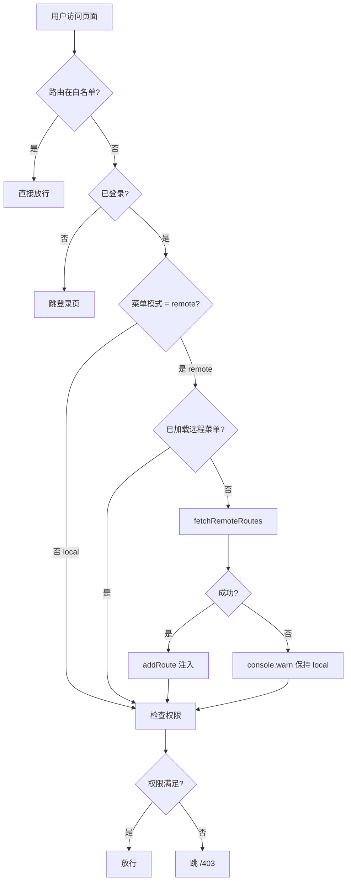

# 路由模块设计

> **文档版本**：v1.0.0 | **最后更新**：2026-07-21
> **覆盖范围**：菜单加载方式（local / remote）、白名单体系、组件注册表、远程菜单 JSON 格式、新增路由流程

---

## 📋 架构总览

```
src/
├── modules/                              # 业务模块（关注点分离）
│   ├── auth/
│   │   ├── views/Login.vue
│   │   └── routes/index.ts               # ← 本模块路由声明（自动注册）
│   ├── dashboard/
│   │   ├── views/Index.vue
│   │   └── routes/index.ts
│   ├── user/
│   │   ├── views/List.vue
│   │   └── routes/index.ts
│   └── error/                            # 错误页（含 catch-all 404，必须手动注册）
│       ├── views/
│       └── routes/index.ts
└── router/
    ├── index.ts                          # 入口：自动注册 + fallback + 守卫
    ├── auto-register.ts                  # import.meta.glob 扫描各模块 routes/ + 派生 COMPONENT_REGISTRY
    ├── fallback.ts                       # catch-all 404 兜底（单独注册避免字典序问题）
    ├── config.ts                         # 路由全局配置（菜单模式）
    ├── whitelist.ts                      # 路由 name 白名单
    ├── types.ts                          # RouteName 联合类型 + RemoteMenuItem 协议
    ├── remote.ts                         # 远程菜单加载 + JSON → RouteRecordRaw 转换
    └── guards/
        └── auth.ts                       # 白名单 + 登录态 + 远程加载 + 权限校验
```

> **为何 catch-all 404 单独注册**：`auto-register.ts` 用 `import.meta.glob` 按字典序扫描，`error` 模块在 `user` 之前。若 catch-all 路由放 error 模块，匹配时会先于 `/user/list`，导致用户页被错误拦截。因此 catch-all 抽到 `router/fallback.ts` 单独注册。

### 错误页模块拆分

| 模块                              | 路由                                | 注册方式                 |
| --------------------------------- | ----------------------------------- | ------------------------ |
| **具名错误页**（403 / 404 / 500） | `src/modules/error/routes/index.ts` | 自动注册                 |
| **catch-all 404 兜底**            | `src/router/fallback.ts`            | 全局手动注册（保证最后） |

### 四层职责

| 层         | 文件                                                                                             | 职责                                                                         |
| ---------- | ------------------------------------------------------------------------------------------------ | ---------------------------------------------------------------------------- |
| **业务层** | `src/modules/<feature>/routes/index.ts`                                                          | 每个业务模块自己声明路由（关注点分离）                                       |
| **配置层** | `router/config.ts`                                                                               | 决定菜单加载模式（local / remote）                                           |
| **定义层** | `router/types.ts`                                                                                | 路由 name 集中定义（`COMPONENT_REGISTRY` 由 `router/auto-register.ts` 派生） |
| **运行层** | `router/auto-register.ts` + `router/whitelist.ts` + `router/remote.ts` + `router/guards/auth.ts` | 自动扫描 + 白名单 + 远程加载 + 守卫执行                                      |

---

## 🔄 菜单加载流程



---

## 🎛️ 菜单加载模式

### 模式选择（src/router/config.ts）

```ts
export const ROUTER_CONFIG = {
  source: resolveMenuSource(),
}
```

| 命令                                  | mode     | 说明                                             |
| ------------------------------------- | -------- | ------------------------------------------------ |
| **`pnpm dev`**（默认）                | `remote` | 默认走接口菜单（贴近生产，强制走 mock 或真接口） |
| **`pnpm dev:local`**                  | `local`  | 切换到本地静态菜单（无需接口即可启动）           |
| **`pnpm build`** + **`pnpm preview`** | `remote` | 生产构建默认走接口                               |

### 切换 local 模式

```bash
# 命令行切换（推荐）
pnpm dev:local

# 或手动设环境变量（在 .env.development 添加）
VITE_MENU_SOURCE=local

# 或临时切换
VITE_MENU_SOURCE=local pnpm dev
```

> **实现位置**：`resolveMenuSource()` 读取 `import.meta.env.VITE_MENU_SOURCE`，未设置时默认 `remote`。
> **dev:local 实现**：`package.json` 中的 `dev:local` script 通过 `cross-env VITE_MENU_SOURCE=local vite` 自动注入环境变量。

### 模式对比

| 维度     | local 模式          | remote 模式                      |
| -------- | ------------------- | -------------------------------- |
| 启动依赖 | 无                  | 需后端 `/api/menu` 返回正确 JSON |
| 权限粒度 | 路由 meta 静态声明  | 后端按角色过滤可见菜单           |
| 新增路由 | 修改代码 + 重新部署 | 后端修改菜单 JSON                |
| 适用阶段 | 开发期 / 演示版     | 生产环境                         |

---

## 🔓 白名单体系（按路由 name）

### 设计决策：为什么按 name 而不是 path？

| 维度           | 按 path 匹配             | **按 name 匹配（采纳）** |
| -------------- | ------------------------ | ------------------------ |
| 路由 path 变化 | 白名单失效               | name 不变，白名单仍生效  |
| 类型安全       | 字符串拼写错误 TS 难发现 | `RouteName` 联合类型约束 |
| 后端注入路由   | path 不可控              | name 在前端注册表内可控  |
| 通配符支持     | 需正则                   | 仅枚举，集合查询 O(1)    |

### 白名单路由（src/router/whitelist.ts）

```ts
export const ROUTE_WHITE_LIST: ReadonlySet<RouteName> = new Set<RouteName>([
  'Login', // 登录页
  'Forbidden', // 403 无权限
  'NotFound', // 404 页面
  'ServerError', // 500 页面
])
```

### 业务路由加入白名单

例如：让"预览页"（任何人可访问，无需登录）加入白名单：

```ts
// 1. 在 router/types.ts 追加 RouteName
export type RouteName =
  'Login' | 'Dashboard' | 'UserList' | 'Forbidden' | 'NotFound' | 'ServerError' | 'Preview'

// 2. 在 router/whitelist.ts 加入白名单
export const ROUTE_WHITE_LIST: ReadonlySet<RouteName> = new Set<RouteName>([
  'Login',
  'Forbidden',
  'NotFound',
  'ServerError',
  'Preview', // ← 跳过登录 + 权限
])

// 3. 在 modules/preview/routes/index.ts 定义路由
// 完成 —— 路由自动可用，remote 模式自动可用（component 由 auto-register.ts 派生）
```

### 判定函数

```ts
isWhiteListed(to.name) // 返回 boolean
```

在守卫中调用，命中即跳过所有检查（登录、权限、远程加载）。

---

## 📦 组件注册表（auto-register.ts 派生）

> ⚠️ 旧版的 `src/router/component-registry.ts` 已删除。`COMPONENT_REGISTRY` 现在由 `src/router/auto-register.ts` 从 `autoRegisteredRoutes` 递归提取 `(name, component)` 派生，**新增业务路由从 3 处改动降为 1 处**（routes/index.ts 写一次即可）。

```ts
// src/router/auto-register.ts 片段（实现细节）
export const COMPONENT_REGISTRY: Record<string, () => Promise<unknown>> = (() => {
  const map: Record<string, () => Promise<unknown>> = {}
  const visit = (routes: RouteRecordRaw[]): void => {
    for (const route of routes) {
      if (route.name && route.component) {
        const name = String(route.name)
        if (map[name]) {
          console.warn(`[router/auto-register] 重复的路由 name: ${name}（后注册会覆盖）`)
        }
        map[name] = route.component as () => Promise<unknown>
      }
      if (route.children?.length) visit(route.children)
    }
  }
  visit(autoRegisteredRoutes)
  return map
})()
```

### 为什么需要这个映射？

| 方案                         | 优点                        | 缺点                                                      |
| ---------------------------- | --------------------------- | --------------------------------------------------------- |
| 后端返回 component 路径      | 实现简单                    | 泄露前端源码结构（如 `/src/modules/user/views/List.vue`） |
| 后端返回 key + 前端映射表    | **安全 + 类型约束**（采纳） | 需前端维护映射表                                          |
| 后端返回 path + 前端静态注册 | 不泄露                      | 后端要懂前端路由                                          |

**采纳**：后端只返回业务路由 name + 路径 + meta，组件路径在前端 `COMPONENT_REGISTRY` 维护。TS 联合类型保证拼写错误立即报错。

---

## 🌐 远程菜单 JSON 格式

后端 `/api/menu` 接口返回（与 `src/router/types.ts` 中 `RemoteMenuItem` 协议一致）：

```json
[
  {
    "name": "Dashboard",
    "path": "/dashboard",
    "meta": {
      "title": "仪表盘",
      "icon": "odometer",
      "requiresAuth": true
    }
  },
  {
    "name": "UserList",
    "path": "/user/list",
    "meta": {
      "title": "用户管理",
      "icon": "user",
      "requiresAuth": true,
      "permissions": ["user:view"]
    }
  },
  {
    "name": "UserDetail",
    "path": "/user/detail/:id",
    "meta": {
      "title": "用户详情",
      "requiresAuth": true,
      "permissions": ["user:view"],
      "hidden": true
    },
    "children": []
  }
]
```

### 字段说明

| 字段               | 必填 | 说明                                         |
| ------------------ | ---- | -------------------------------------------- |
| `name`             | ✅   | 业务路由名，对应 `COMPONENT_REGISTRY` 的 key |
| `path`             | ✅   | 路由 path（支持动态参数如 `:id`）            |
| `meta.title`       | 推荐 | 菜单标题（侧边栏 / 面包屑）                  |
| `meta.icon`        | 推荐 | 菜单图标（Element Plus icon 名）             |
| `meta.permissions` | 可选 | 权限数组，匹配 `userStore.permissions`       |
| `meta.hidden`      | 可选 | 是否在菜单中隐藏（但路由仍可访问）           |
| `children`         | 可选 | 多级菜单嵌套                                 |

### 失败回退（已在 remote.ts 实现）

```ts
export async function fetchRemoteRoutes(): Promise<RouteRecordRaw[]> {
  try {
    const menu = await menuApi.getMenu()
    return convertMenu(menu)
  } catch (err) {
    console.warn('[router/remote] 接口加载菜单失败:', err)
    return [] // ← 返回空数组，由守卫决定 fallback
  }
}
```

守卫行为：`fetchRemoteRoutes()` 返回空数组时 `console.warn` + 保持 local 菜单（不阻塞用户）。

---

## ➕ 新增路由的标准流程

### 步骤 1：定义视图组件

```vue
<!-- src/modules/order/views/List.vue -->
<template>
  <div>订单列表</div>
</template>
```

### 步骤 2：在 `types.ts` 追加 RouteName

```ts
export type RouteName =
  | 'Login'
  | 'Dashboard'
  | 'UserList'
  | 'OrderList' // ← 新增
  | 'Forbidden'
  | 'NotFound'
  | 'ServerError'
```

### 步骤 3（自动注册版）：在 `src/modules/order/routes/index.ts` 声明路由

业务模块新增路由**无需修改 `src/router/` 任何文件**，`auto-register.ts` 会自动扫描到本文件并注册。

```ts
// src/modules/order/routes/index.ts（新建文件）
import type { RouteRecordRaw } from 'vue-router'

const routes: RouteRecordRaw[] = [
  {
    path: '/order',
    component: () => import('@/layouts/default/index.vue'),
    children: [
      {
        path: 'list',
        name: 'OrderList',
        component: () => import('../views/List.vue'),
        meta: {
          title: '订单管理',
          icon: 'list',
          requiresAuth: true,
          permissions: ['order:view'],
        },
      },
    ],
  },
]

export default routes
```

### 步骤 4：（可选）加入白名单

```ts
// src/router/whitelist.ts
export const ROUTE_WHITE_LIST = new Set<RouteName>([
  // ...
  'OrderList', // ← 仅当该路由需跳过登录/权限时加入
])
```

### local 模式 vs remote 模式

| 模式       | 路由来源                                                            | 新增路由流程             |
| ---------- | ------------------------------------------------------------------- | ------------------------ |
| **local**  | `src/modules/**/routes/index.ts` 自动注册                           | 步骤 1-4 全部完成即可    |
| **remote** | `src/modules/**/routes/index.ts`（兜底）+ 后端 `/api/menu` 动态注入 | 步骤 1-4 + 后端菜单 JSON |

> **关键差异**：remote 模式下，即便前端没写 `routes/index.ts`，只要后端返回对应 `name` + 路径 + meta，路由仍可用。但建议前端仍保留 `routes/index.ts` 作为"已知路由清单"，便于类型约束与代码可读性。

> **关于 component-registry**：原 `src/router/component-registry.ts` 已合并到 `src/router/auto-register.ts`，`COMPONENT_REGISTRY` 由自动扫描到的 `autoRegisteredRoutes` 派生。因此新增业务路由从"types.ts + component-registry.ts + routes/index.ts" 三处改动降为"types.ts + routes/index.ts" 两处，`scripts/check-routes.ts` 也同步移除 component-registry 校验项。

---

## ✅ 评审 Checklist

```
□ 1. 新增路由是否在 types.ts 的 RouteName 联合类型追加？
□ 2. local 模式新增路由是否在 router/index.ts 注册？
□ 3. 路由 meta.permissions 是否与后端权限码一致？
□ 4. 白名单新增项是否经过评审（避免误开放）？
□ 5. 路由组件是否使用 () => import() 懒加载？
□ 6. remote 模式下后端是否返回了所有可见菜单？
□ 7. 守卫日志（console.info / console.warn）是否过多影响性能？
□ 8. dynamicLoaded 状态在登出后是否正确重置？
```

---

## ❓ FAQ

### Q1：dev 模式能否强制使用 local（无接口时开发）？

**A**：可以。`pnpm dev:local` 命令自动设 `VITE_MENU_SOURCE=local`，无需编辑配置文件。也可手动在 `.env.development` 加 `VITE_MENU_SOURCE=local`。

### Q2：后端返回了 `name` 但前端 `COMPONENT_REGISTRY` 没注册会怎样？

**A**：`convertItem()` 中 `console.warn` 提示"未注册的路由 name: xxx"，跳过该项。其他有效路由仍正常注册。建议前后端协同：新增路由必须前端先合并代码。

### Q3：白名单路由还需要挂 layout 吗？

**A**：建议仍挂 layout（如 `Login` 用 `blank` layout），避免裸路由破布局。白名单仅跳过守卫检查，不影响路由组件结构。

### Q4：登出后 `dynamicLoaded` 是否重置？

**A**：是。守卫中跟踪 `currentToken`，token 变化（新登录 / 登出）时重置 `dynamicLoaded = false`，下次进入会自动重新拉取远程菜单。

### Q5：remote 模式下 local 路由还有用吗？

**A**：有用。local 路由（404 / 403 / 500 / Login）是守卫兜底用，远程菜单加载失败时仍可访问。即使全 remote 模式，local 路由也必须保留。

### Q6：能否让某个菜单项只对特定角色可见？

**A**：remote 模式在后端过滤（推荐）。local 模式用 `meta.permissions` + `userStore.permissions` 校验。

---

## 🔗 相关文档

- 主题管理规范：`docs/06-主题管理规范.md`
- BEM 样式规范：`docs/05-BEM样式规范.md`
- 构建工具配置：`docs/04-构建与测试工具.md`
- 源码：
  - `src/router/index.ts`（路由入口）
  - `src/router/auto-register.ts`（自动注册：扫描 src/modules/**/routes/index.ts + 派生 COMPONENT_REGISTRY）
  - `src/router/config.ts`（菜单模式配置）
  - `src/router/whitelist.ts`（白名单）
  - `src/router/types.ts`（RouteName 联合类型）
  - `src/router/remote.ts`（远程菜单加载）
  - `src/router/guards/auth.ts`（路由守卫）
  - `src/router/fallback.ts`（catch-all 404 兜底，单独注册保证最后）
  - `src/modules/<feature>/routes/index.ts`（业务模块路由声明，**自动注册**）
  - `src/api/modules/menu.ts`（菜单 API）
