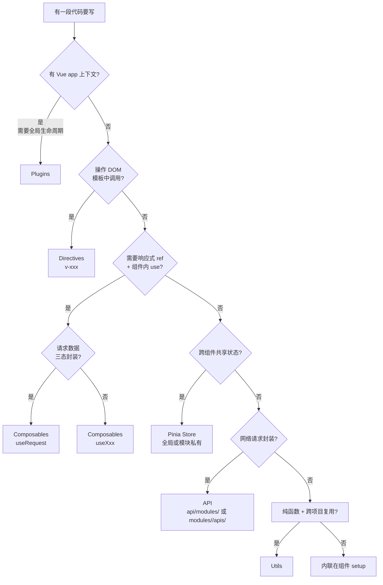

# 代码组织决策表

> **文档版本**：v1.0.0 | **最后更新**：2026-07-24
> **覆盖范围**：当你有一段代码要写时，「该放哪个目录 / 写成 directives / plugins / utils / composables / store / api 哪种形式」的端到端判断标准
> **适用读者**：第 1 次接触项目的新人 + 跨边界写代码的老成员

---

## 1. 一句话原则

> **先判断「这段代码的副作用 / 复用范围 / 生命周期」，再用本表的决策树定位目录。**

| 判断维度     | 选项                                                 |
| ------------ | ---------------------------------------------------- |
| **副作用**   | 纯函数 / 操作 DOM / 操作全局 / 操作网络 / 操作数据流 |
| **复用范围** | 仅本组件 / 仅本模块 / 跨模块共享 / 跨项目            |
| **生命周期** | 一次执行 / 跟组件实例 / 跟应用实例 / 跟浏览器        |

---

## 2. 六方决策矩阵（核心）

> **用法**：从左到右依次匹配，第一个 ✅ 命中即确定归宿。

| 我要做的事…                              | 该放哪                                                                                      | 形式                   | 关键判断                                                        | 反例（错放）                                                     |
| ---------------------------------------- | ------------------------------------------------------------------------------------------- | ---------------------- | --------------------------------------------------------------- | ---------------------------------------------------------------- |
| **给 `<input>` 加输入防抖**              | `src/directives/`                                                                           | `v-inputDebounce`      | 操作 DOM + 模板声明式调用                                       | 写成 composable 就必须每个组件 import（重复代码）                |
| **接 Sentry 错误上报到 Vue 全局**        | `src/plugins/`                                                                              | `errorHandler.report`  | 需要 `app` 实例 + 接管 Vue 全局错误生命周期                     | 写成 utils 就只能手动调用，无法拦截未捕获异常                    |
| **封装「深拷贝 / 树扁平化 / ID 生成」**  | `src/utils/`                                                                                | 纯函数 + `.spec.ts`    | 纯函数 + 与框架解耦 + 跨模块复用                                | 写成 composable 就强行引入 Vue 依赖，无法在 store/service 里复用 |
| **组件内「加载中/成功/失败」三态请求**   | `src/composables/`                                                                          | `useRequest`           | 组件内 use + 返回 ref + 跟组件生命周期                          | 写成 utils 返回普通 Promise 就拿不到响应式 data                  |
| **跨 5 个页面共享当前选中的订单**        | `src/store/modules/order.ts`（全局）<br>或 `src/modules/<m>/store/order.ts`（模块私有）     | Pinia Setup Store      | 跨模块用全局；仅本模块用私有                                    | 写成 utils 全局变量就丢失响应式 + DevTools 支持                  |
| **封装 `/api/user/list` 接口**           | `src/api/modules/user.ts`（跨模块共享）<br>或 `src/modules/<m>/apis/index.ts`（仅本模块用） | request 封装 + TS 类型 | 多页共用同接口 → 全局；强内聚 → 模块内                          | 直接在组件里 `axios.get()` 就跳过 14 个基建能力                  |
| **业务代码里调用 `useRouter` / `axios`** | `@composables/useAppRouter` / `@composables/useRequest`                                     | 项目封装 composable    | 业务代码必须用封装，ESLint `no-restricted-imports` 自动 warning | 跳过封装就丢错误处理 toast、loading 三态、AbortController        |

---

## 3. 五条核心边界（不要踩）

| 边界                          | 该这样                                             | 不要这样                                                                  | 原因                                                 |
| ----------------------------- | -------------------------------------------------- | ------------------------------------------------------------------------- | ---------------------------------------------------- |
| **modules 不互相 import**     | `modules/a` 通过 `modules/a/index.ts` 暴露对外接口 | `modules/a/views/X.vue` 直接 `import { YStore } from '@/modules/b/store'` | 模块间通信必须走「对外接口」抽象层，否则变成意大利面 |
| **common 组件不依赖 modules** | `src/components/common/` 可引用 utils/store        | 不能 `import X from '@/modules/xxx'`                                      | 否则全局组件无法独立 tree-shake                      |
| **directives 不调用 store**   | directives 只操作 DOM                              | `v-permission` 直接 `import { useUserStore }`                             | directives 应保持纯 DOM 行为，业务态读取交给组件层   |
| **utils 不依赖 Vue/Pinia**    | 纯 TS 函数                                         | utils 里 `import { ref } from 'vue'`                                      | 与框架解耦，可在 Node 测试 / SSR / 其他项目复用      |
| **store 不存网络请求中间态**  | loading 放组件或 composable                        | `useUserStore().loading` 全局共享                                         | 跨页面共享 loading 会互相污染                        |

---

## 4. 决策树（Mermaid）



---

## 5. 反例对照表（30 个常见错放）

| #   | 错放                                                      | 后果                                                    | 正确做法                                                         |
| --- | --------------------------------------------------------- | ------------------------------------------------------- | ---------------------------------------------------------------- |
| 1   | 「格式化日期」写成 composable                             | 每个组件 import，重复代码                               | 抽到 `src/utils/dayjs.ts`                                        |
| 2   | 「复制到剪贴板」写成 plugin                               | 必须 `app.use(clipboard)` 才能用                        | 抽到 `src/utils/clipboard.ts`                                    |
| 3   | 「loading 状态」放全局 store                              | 跨页面互相污染                                          | 放组件 `ref` 或 `useRequest.loading`                             |
| 4   | 业务接口写在组件 `onMounted` 里直接 `axios.get`           | 跳过 401 refresh + token + cache 等 14 个基建           | 写 `src/api/modules/<feature>.ts`                                |
| 5   | common 组件里 `import X from '@/modules/user'`            | 模块无法 tree-shake，循环依赖风险                       | 用 props/emit 传值，或建 `modules/<m>/index.ts` 对外接口         |
| 6   | directives 里 `import { useUserStore }`                   | directives 失去纯 DOM 特性                              | 业务态读取移到组件层，directive 只收参数                         |
| 7   | utils 文件里 `import { ref } from 'vue'`                  | 无法在 store/Node/SSR 复用                              | 保持纯 TS                                                        |
| 8   | 模块 A 直接 `import { BStore } from '@/modules/b/store'`  | 强耦合，删除 B 后 A 编译失败                            | 通过 `modules/b/index.ts` 暴露 `getBStore()`                     |
| 9   | 路由 `meta.permissions` 写在组件 `onMounted` 里判断       | 路由守卫拿不到，权限失效                                | 写在 `routes/index.ts` 的 `meta.permissions`                     |
| 10  | 「全局 loading」用 `utils/loading.ts` 单例 + EventBus     | 失去响应式，组件不刷新                                  | 用 `src/store/modules/app.ts` 暴露 `useAppStore().globalLoading` |
| 11  | 业务 store 放 `src/store/modules/`                        | 污染全局 store 边界                                     | 仅本模块用放 `src/modules/<m>/store/`                            |
| 12  | 跨模块共享 store 放 `src/modules/<m>/store/`              | 其他模块无法 import                                     | 提到 `src/store/modules/`                                        |
| 13  | 通用 UI 组件（按钮/弹窗）放 `src/modules/<m>/components/` | 其他模块复用不到                                        | 放 `src/components/common/`（自动注册）                          |
| 14  | 工具函数没写 `.spec.ts`                                   | CI 通过但实际有 bug                                     | 每个 util 必须配 `.spec.ts`                                      |
| 15  | 组件 props 改用 `ref` 接住再改                            | ESLint `vue/no-mutating-props` 报错                     | props 只读，要改 emit 事件                                       |
| 16  | 主题感知颜色用 JS 判断 `isDark` 切 class                  | 失去 CSS 变量原子切换能力                               | 直接用 `var(--bg-base)`                                          |
| 17  | mock 数据写在 `src/api/` 目录                             | 与真实接口混在一起，prod 残留                           | 写 `mock/<feature>.ts`                                           |
| 18  | i18n key 散落在每个组件                                   | 翻译查找困难，删 key 漏改                               | 集中 `src/locales/{zh-CN,en-US}.ts`                              |
| 19  | 「登录 token」存到 utils 单例 + LocalStorage              | 失去响应式 + 多标签页同步失效                           | 用 `src/store/modules/user.ts` + `pinia-plugin-persistedstate`   |
| 20  | 「权限判断」写成组件内函数                                | 每个组件重复 `useUserStore().permissions.includes(...)` | 用 `useAuth()` composable + `v-auth` 指令                        |
| 21  | 路由跳转写 `router.push('/user/list')`                    | 字符串路径拼写错误无类型保护                            | 用 `useAppRouter().pushByName('UserList')`                       |
| 22  | 全局错误处理写 try/catch 散落在每个组件                   | 漏写一处就崩溃                                          | 用 `plugins/errorHandler` 接管 + 上报 Sentry                     |
| 23  | 表单校验写在 template 内联表达式                          | 复杂表达式难维护                                        | 用 Element Plus `el-form` + `rules` 对象                         |
| 24  | 「loading 防抖」自己写 setTimeout                         | 重复实现 + 内存泄漏风险                                 | 用 `v-inputDebounce` 指令                                        |
| 25  | 流式响应写 `fetch` + `ReadableStream`                     | 跳过项目封装的 `requestStream` + 取消逻辑               | 用 `requestStream`（详见 docs/13）                               |
| 26  | 后端分页字段名硬编码 `{ records, total }`                 | 后端改字段名全项目崩溃                                  | 用 `pageAdapter` 配置（详见 docs/15）                            |
| 27  | 「页面 keepAlive」写在组件 `<keep-alive>`                 | 与路由 `meta.keepAlive` 冲突                            | 用 `meta.keepAlive: true`                                        |
| 28  | 「菜单 icon」用本地 SVG 文件                              | 无法与 Element Plus icon 系统集成                       | 用 Element Plus icon 名（`icon: 'user-filled'`）                 |
| 29  | 「模块测试」写 e2e 而不是单测                             | 跑得慢，难定位                                          | 工具/composable/store 用 Vitest 单测；关键流程才上 e2e           |
| 30  | 「CI 报错」靠本地反复改                                   | 反馈循环慢                                              | 用 `pnpm type-check + lint + test` 本地跑全量                    |

---

## 6. 三层组件边界（components/）

```
src/components/
├── common/              # 通用组件（与业务无关，跨模块复用）
│   ├── AsyncState.vue   # 三态渲染容器
│   └── ErrorBoundary.vue
├── layout/              # 路由级布局（与 default/blank 配套）
│   ├── Header.vue
│   └── Sidebar.vue
└── index.ts             # 自动注册 common/ 下所有 .vue（_ 前缀跳过）

src/modules/<m>/
├── components/          # 模块私有组件（仅本模块使用）
│   └── OrderForm.vue
└── views/               # 路由级页面组件（被 auto-register 引用）
    └── List.vue
```

**判断标准**：

| 组件类型                       | 放哪                          | 例子                                   |
| ------------------------------ | ----------------------------- | -------------------------------------- |
| 任何模块都可能复用、与业务无关 | `src/components/common/`      | AsyncState / ErrorBoundary / DataTable |
| 路由级布局（Sidebar/Header）   | `src/components/layout/`      | Header / Sidebar / Breadcrumb          |
| 仅本模块使用                   | `src/modules/<m>/components/` | OrderForm / UserCard                   |
| 路由级页面                     | `src/modules/<m>/views/`      | List / Detail / Index                  |

---

## 7. 两层 store 边界（store/）

```
src/store/modules/                      # 全局：跨模块共享
├── app.ts       # 侧边栏、语言、全局 loading
├── user.ts      # token / profile / 权限（持久化）
├── theme.ts     # 主题模式（持久化）
├── router.ts    # 路由 UI 状态
├── dict.ts      # 字典（5min 业务层缓存）
└── tags-view.ts # 多页签状态

src/modules/<m>/store/                  # 模块私有：仅本模块用
├── index.ts     # Setup Store 风格
└── ...
```

**判断标准**：

| 场景                       | 放哪                     | 例子                           |
| -------------------------- | ------------------------ | ------------------------------ |
| 跨 ≥2 个模块使用           | `src/store/modules/`     | `user`（token 任何模块都要读） |
| 仅本模块使用，跨 ≥2 个组件 | `src/modules/<m>/store/` | `modules/order/store/cart.ts`  |
| 仅单个组件使用             | 组件内 `ref`             | 表单临时态                     |

---

## 8. 三层 API 边界（api/）

```
src/api/
├── http.ts                # 网络基建：拦截器链 + 14 个能力
├── token-refresh.ts       # 401 自动 refresh
├── cache.ts               # GET 缓存（30s TTL）
├── request-merger.ts      # 同参请求合并（50ms 窗口）
├── page-adapter.ts        # 分页字段名适配
├── validator.ts           # Zod schema 校验
├── stream.ts              # SSE / NDJSON 流式
├── cancel.ts              # AbortController 工具
├── global-abort.ts        # logout 全局取消
└── modules/               # 各业务模块 API
    ├── auth.ts
    ├── user.ts
    ├── menu.ts
    ├── dict.ts
    └── ...

src/modules/<m>/apis/      # 模块私有 API（仅本模块用）
└── index.ts
```

**判断标准**：

| 场景                 | 放哪                                        | 例子                                        |
| -------------------- | ------------------------------------------- | ------------------------------------------- |
| 跨 ≥2 个模块共用接口 | `src/api/modules/<feature>.ts`              | `/api/user/list`（user + admin 模块都要用） |
| 仅本模块使用         | `src/modules/<m>/apis/index.ts`             | `/api/order/internal-status`（仅订单模块）  |
| 后续可能跨模块       | 先放模块私有，重构时迁到 `src/api/modules/` | —                                           |

> 详见 `docs/15-请求层缓存-合并-分页适配使用规范.md`。

---

## 9. 真实代码示例对比

### ❌ 反例 1：utils 写成 composable

```ts
// src/composables/useDayjs.ts  ← 错！
import dayjs from 'dayjs'
export function useDayjs() {
  return { format: (d: Date) => dayjs(d).format('YYYY-MM-DD') }
}
```

**问题**：

- 每个组件都要 import 才能用
- 在 store / utils / 单测里没法直接调
- 没有响应式需求，强行套 `useXxx` 无意义

### ✅ 正例 1：utils 纯函数

```ts
// src/utils/dayjs.ts  ← 对！
import dayjs from 'dayjs'

export function formatDate(input: Date | string | number, pattern = 'YYYY-MM-DD'): string {
  return dayjs(input).format(pattern)
}

// 单测可直接调，无需 mount Vue
```

### ❌ 反例 2：组件内直接 axios

```vue
<!-- OrderList.vue  ← 错！ -->
<script setup lang="ts">
import axios from 'axios'
import { ref, onMounted } from 'vue'

const orders = ref([])
onMounted(async () => {
  const res = await axios.get('/api/order/list')
  orders.value = res.data.data.list
})
</script>
```

**问题**：

- 跳过 401 自动 refresh（要重新登录）
- 跳过 cache / merge / pageAdapter 等 14 个基建
- 错误无统一处理（无 toast / 无 Sentry）
- TS 类型无 schema 校验

### ✅ 正例 2：API 模块 + useRequest

```ts
// src/api/modules/order.ts  ← 对！
import { request } from '@/api/http'
import { z } from 'zod'

export const OrderSchema = z.object({
  id: z.number(),
  status: z.enum(['pending', 'shipped']),
})

export const orderApi = {
  getList: (params: { page: number; pageSize: number }) =>
    request<Pagination<OrderItem>>({
      url: '/order/list',
      method: 'get',
      params,
      usePageAdapter: true,
    }),
}
```

```vue
<!-- OrderList.vue  ← 对！ -->
<script setup lang="ts">
import { useRequest } from '@/composables/useRequest'
import { orderApi } from '@/api/modules/order'

const { data, loading, error, isEmpty, refresh } = useRequest(() =>
  orderApi.getList({ page: 1, pageSize: 20 })
)
</script>
```

---

## 10. 评审 Checklist（PR 必过）

```
□ 1. 新增 directives 有 .d.ts 类型分离？
□ 2. 新增 plugins 在 plugins/index.ts 的 PluginsOptions 加字段（支持 false 关闭）？
□ 3. 新增 utils 有对应 .spec.ts 且单测通过？
□ 4. 新增 composable 遵循 useXxx 命名 + 返回 ref/函数？
□ 5. 新增 store 已判断放全局 vs 模块私有？
□ 6. 新增 API 用 request<T>() 而非裸 axios？
□ 7. modules 之间未互相 import 内部？
□ 8. common 组件未 import 任何 modules/ 内容？
□ 9. utils 未依赖 Vue/Pinia？
□ 10. 新增模块未绕过 pnpm new-module 直接手写？
```

---

## 🔗 相关文档

| 文档                                                   | 范围                                                        |
| ------------------------------------------------------ | ----------------------------------------------------------- |
| `docs/08-模块化架构总览.md`                            | 4 块公共范式（Directives/Plugins/Components/Utils）扩展流程 |
| `docs/19-Pinia store使用规范.md`                       | store 决策表 + 持久化 + 单测模板（**待补**）                |
| `docs/05-BEM样式规范.md` §How to write a new component | 新组件 6 步流程                                             |
| `docs/10-新手指引.md` 任务 2-3                         | 加新模块完整流程                                            |
| `docs/07-路由模块设计.md`                              | 新增路由 6 步流程                                           |
| `docs/15-请求层缓存-合并-分页适配使用规范.md`          | 三件套 API 决策表                                           |
| `docs/17-useRequest使用规范.md`                        | 三态请求决策表                                              |

---

_文档版本：v1.0.0 | 编写日期：2026-07-24 | 配套项目版本：gm-portal-fe 0.x_
