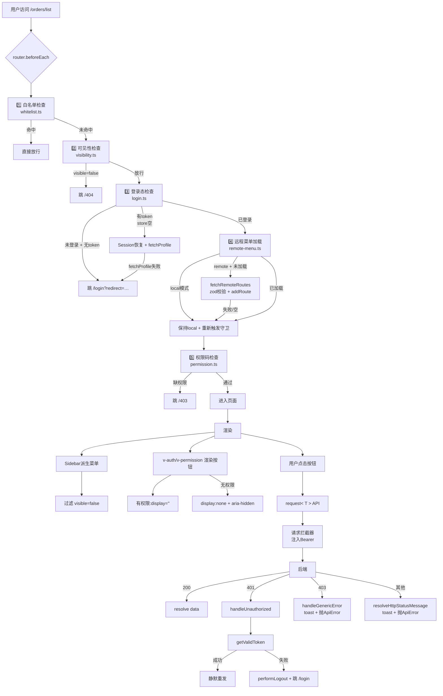
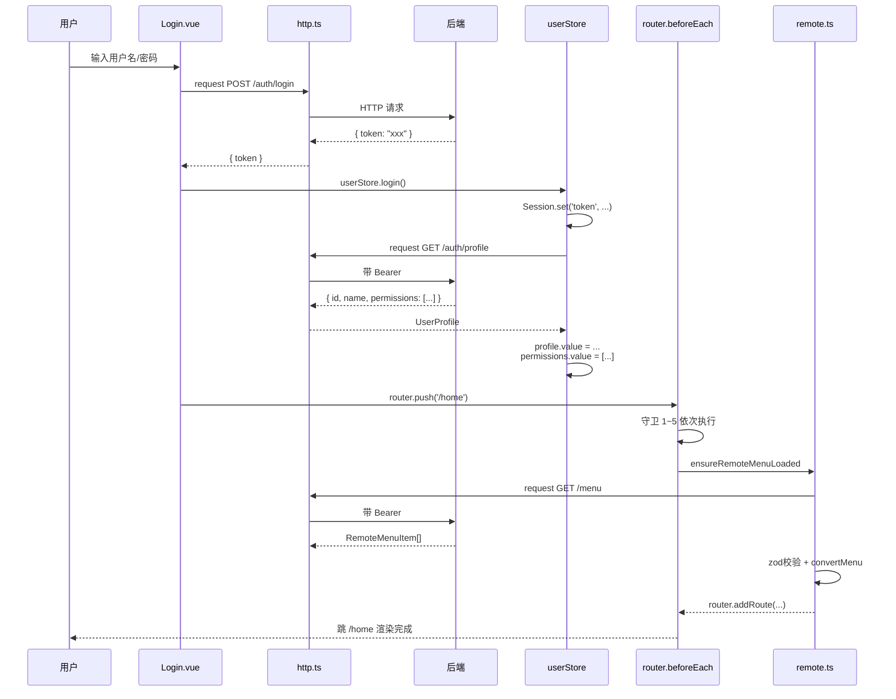
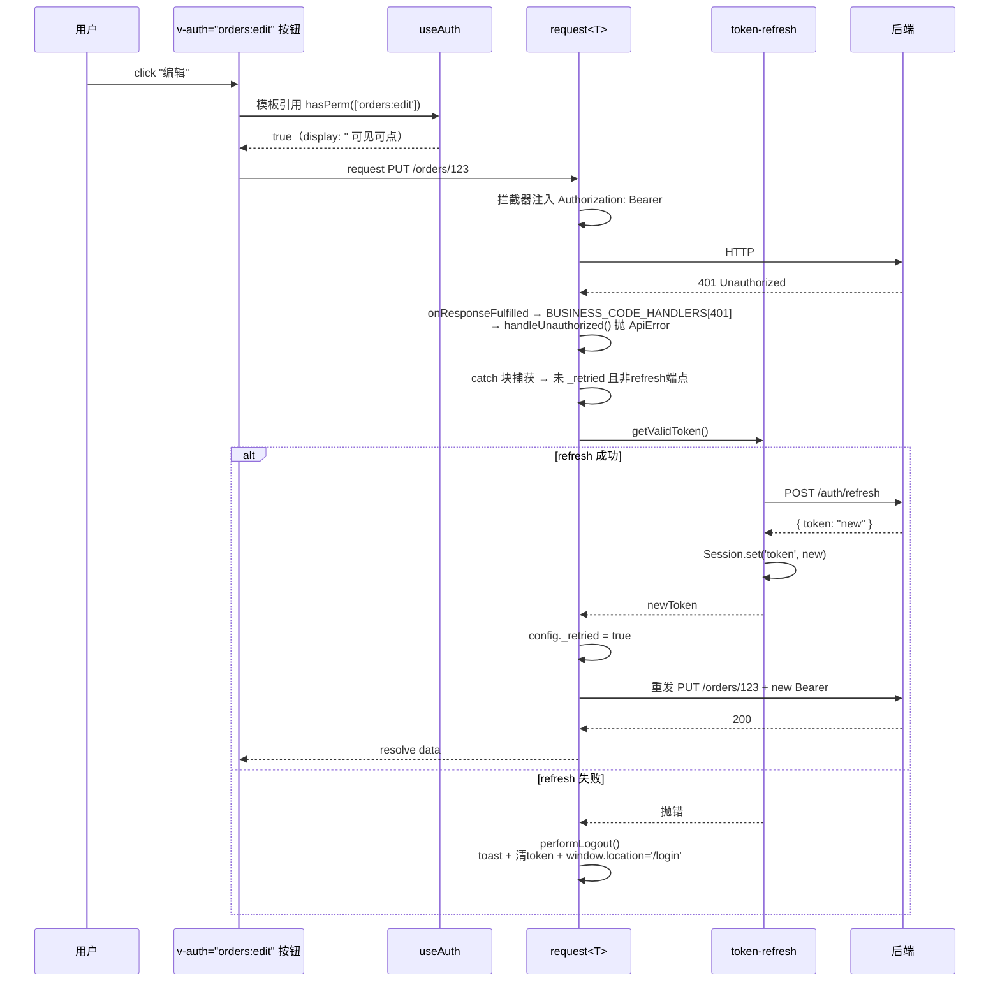
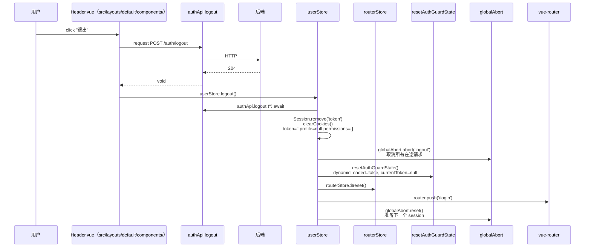
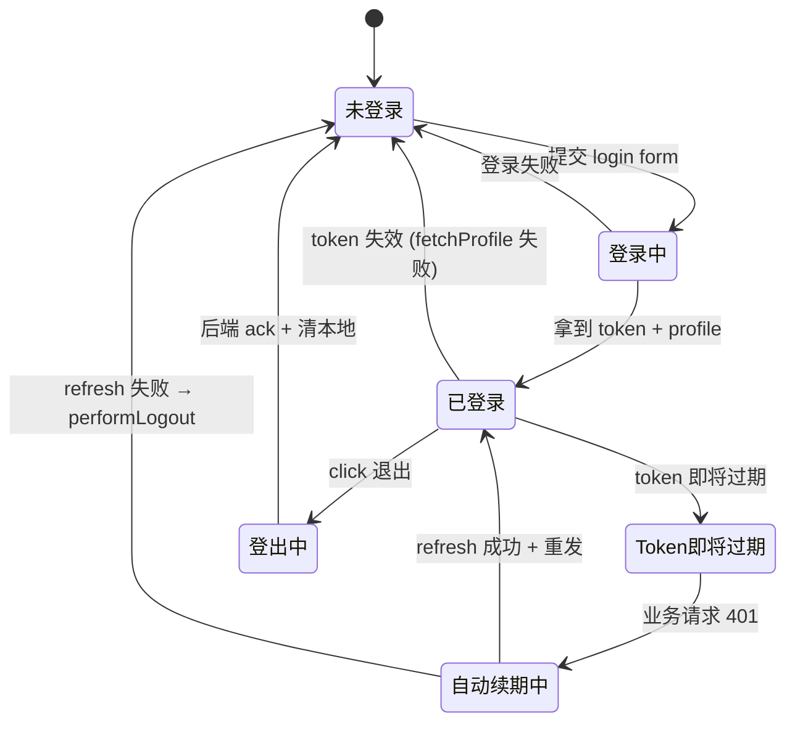
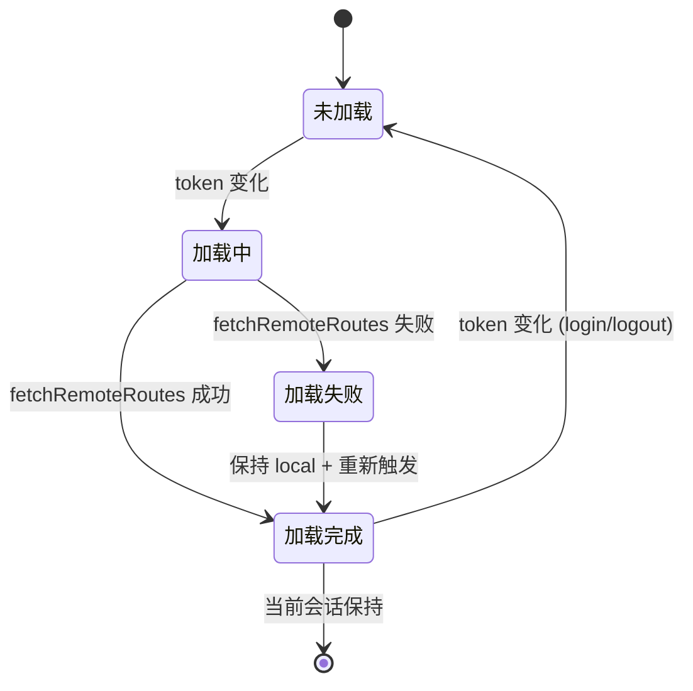
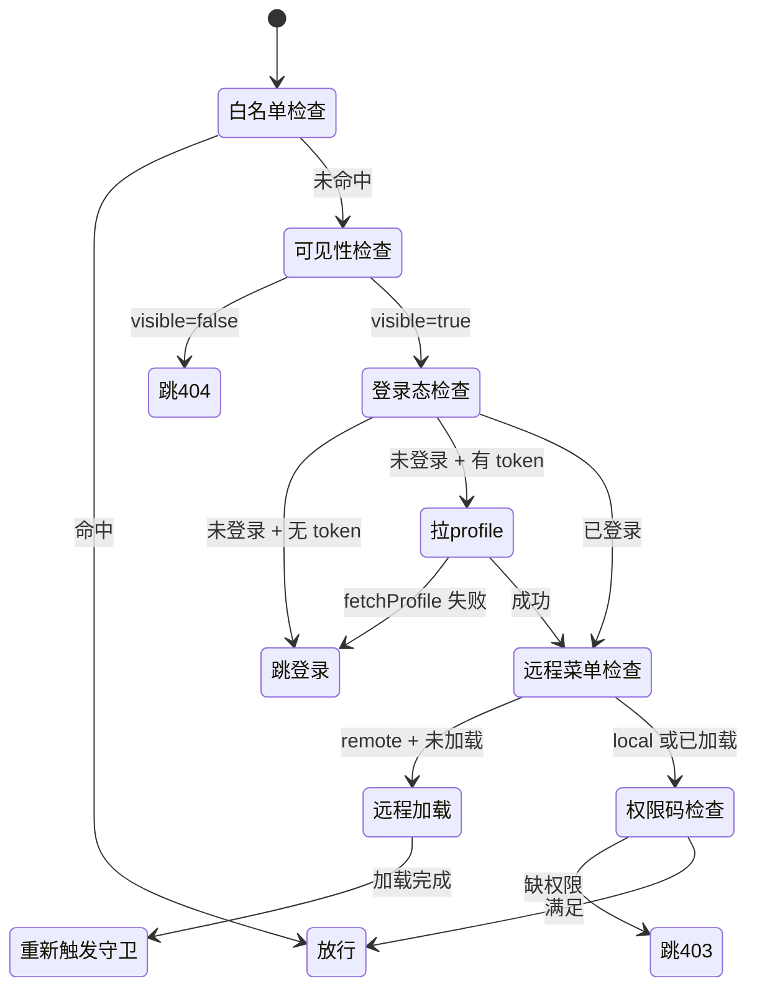

# 权限设计

> **文档版本**：v1.0.0 | **生成日期**：2026-07-28 | **生效分支**：`master`
> **覆盖范围**：端到端权限链路 · 核心数据结构 · 权限码原子数据 · 菜单/路由树 · 4 层实现机制 · 原子数据样例 · 落地清单
> **配套阅读**：`docs/07-路由模块设计.md`（路由级展开）、`docs/16-token自动刷新与全局取消使用规范.md`（token 细节）、`docs/19-Pinia store使用规范.md`（user store）

---

## 一、TL;DR —— 一句话定义

> **"前端只做 UX 收敛，后端才是真实来源"**：本项目采用"扁平权限码 + 4 层 ACL（白名单 → 路由级 → 菜单可见性 → 按钮/DOM 指令 → 编程式 composable）"的轻量方案；任何业务层"写"操作（新增/删除/修改/审批）**必须**由后端二次校验，前端指令与守卫仅是"看不见 / 进不去 / 不可点"的体验层，不承担安全职责。

| 维度     | 取值                                                                        |
| -------- | --------------------------------------------------------------------------- |
| 权限模型 | 扁平权限码（`resource:action`，如 `user:edit`）                             |
| 角色模型 | 枚举已定义（`RoleEnum`），**运行时由后端下发 `permissions: string[]` 替代** |
| 权限源   | 后端 `GET /auth/profile` 下发 `UserProfile.permissions`                     |
| 菜单源   | `local`（本地 routes/index.ts）/ `remote`（后端 `GET /menu`）双模式         |
| 粒度上限 | 路由级 + 菜单级 + 按钮级 + 编程式（**无 row/field/tenant 级抽象**）         |
| 安全断言 | "前端仅 UX；后端兜底"（详见 §11 落地红线）                                  |

---

## 二、端到端链路（从用户输入 URL 到按钮点击）

### 2.1 总览图



### 2.2 关键时序：登录完整链路



### 2.3 关键时序：用户点击受限按钮 → 触发 API → 401 续期



### 2.4 关键时序：登出（悲观 + 路由状态重置）



---

## 三、核心数据结构

### 3.1 权限码（Permission Code）—— 原子数据

**类型定义**：

```ts
// src/store/modules/user.ts:14
const permissions = ref<string[]>([])

// src/api/modules/auth.ts:11-15
export interface UserProfile {
  id: number
  name: string
  permissions: string[] // ← 权限码扁平数组
}
```

**语法约定**（`<resource>:<action>` 两段式，可选 `<resource>:<action>:<scope>`）：

| 段                | 含义        | 约定              | 示例                                                         |
| ----------------- | ----------- | ----------------- | ------------------------------------------------------------ |
| `<resource>`      | 资源/模块名 | kebab-case 或单词 | `user` / `order` / `report` / `dict`                         |
| `<action>`        | 动作        | 单词动词          | `view` / `create` / `edit` / `delete` / `export` / `approve` |
| `<scope>`（可选） | 数据范围    | kebab-case        | `own` / `dept` / `all`（预留）                               |

**示例**：

```
user:view            // 用户管理 - 查看
user:create          // 用户管理 - 新增
user:edit            // 用户管理 - 编辑
user:delete          // 用户管理 - 删除
user:export          // 用户管理 - 导出
order:view           // 订单管理 - 查看
order:approve        // 订单管理 - 审批
order:view:own       // 订单管理 - 仅查看自己的（数据范围，后端过滤）
report:export        // 报表 - 导出
dict:edit            // 字典 - 编辑
```

> **约定即契约**：权限码字符串由后端定义并通过 `/auth/profile` 下发，前端**不发明**任何权限码；新增权限需前后端同步对齐。

### 3.2 角色枚举（RoleEnum）—— **已定义但运行时未使用**

```ts
// src/enums/roleEnum.ts:1-13
export enum RoleEnum {
  SUPER_ADMIN = 'super_admin',
  ADMIN = 'admin',
  USER = 'user',
  GUEST = 'guest',
}

export const ROLE_LABELS: Record<RoleEnum, string> = {
  [RoleEnum.SUPER_ADMIN]: '超级管理员',
  [RoleEnum.ADMIN]: '管理员',
  [RoleEnum.USER]: '普通用户',
  [RoleEnum.GUEST]: '访客',
}
```

> **当前事实**（2026-07-28 grep 全仓 0 hits）：`RoleEnum` 仅在自身文件 + 部分 spec 文件被引用，**运行时没有任何代码根据 role 字段做判定**。实际生效的是后端下发的扁平 `permissions: string[]`。
> **设计意图**：保留枚举作为**未来"前端角色粗筛 + 后端权限码精筛"双层模型**的扩展点；当后端开始下发 `role: string` 字段时再启用。

### 3.3 路由元数据（RouteMeta）—— 路由级权限声明

```ts
// src/router/types.ts:30-53
declare module 'vue-router' {
  interface RouteMeta {
    title?: string // 菜单标题（兜底）
    titleKey?: string // i18n key（推荐）
    icon?: string // Element Plus icon 名
    requiresAuth?: boolean // 是否需登录（标记用，实际由 isLoggedIn 判定）
    permissions?: string[] // 权限码数组（AND 语义：全部满足才放行）
    visible?: boolean // 路由可见性，false 时菜单隐藏且禁止直接访问
    keepAlive?: boolean // 缓存组件实例
    breadcrumb?: boolean // 面包屑展示
    affix?: boolean // 多页签固定（如 Home）
    [key: string]: unknown // 业务自定义字段透传
  }
}
```

> **`hidden` 不在 RouteMeta 中**——仅用于后端菜单 JSON 协议（`RemoteMenuItem.meta.hidden`），远程加载时由 `src/router/remote.ts:171-180` 转换为前端的 `meta.visible: false`。

### 3.4 后端菜单协议（RemoteMenuItem）—— 远程模式数据契约

```ts
// src/router/types.ts:83-94
export interface RemoteMenuItem {
  name: string // 业务路由名（对应 COMPONENT_REGISTRY）
  path: string // 路由 path
  meta?: AppRouteMeta & {
    hidden?: boolean // 后端标记隐藏 → 前端转 visible: false
  }
  children?: RemoteMenuItem[] // 多级菜单嵌套
}
```

**后端 JSON 示例**（`GET /menu` 响应）：

```json
[
  {
    "name": "Home",
    "path": "/home",
    "meta": { "title": "首页", "icon": "odometer", "requiresAuth": true, "affix": true }
  },
  {
    "name": "UserList",
    "path": "/user/list",
    "meta": {
      "title": "用户管理",
      "icon": "user",
      "requiresAuth": true,
      "permissions": ["user:view"]
    }
  },
  {
    "name": "OrderList",
    "path": "/order/list",
    "meta": { "title": "订单管理", "icon": "list", "permissions": ["order:view"] },
    "children": [
      {
        "name": "OrderDetail",
        "path": "detail/:id",
        "meta": { "title": "订单详情", "permissions": ["order:view"], "hidden": true }
      }
    ]
  }
]
```

> **关键安全约束**：后端**绝不**返回 `component` 路径（避免泄露前端源码结构），组件路径在前端 `COMPONENT_REGISTRY` 维护。

### 3.5 路由白名单（ROUTE_WHITE_LIST）—— 跳过所有检查

```ts
// src/router/whitelist.ts:28-35
export const ROUTE_WHITE_LIST: ReadonlySet<string> = new Set<string>([
  'Login', // 登录页
  'Forbidden', // 403 无权限
  'NotFound', // 404 页面
  'ServerError', // 500 页面
  ...(import.meta.env.DEV ? demoRouteNames : []), // dev 模式追加 demo 路由
])
```

### 3.6 业务码（BusinessCode）—— 后端响应码契约

```ts
// src/enums/httpEnum.ts:13-17
export enum BusinessCode {
  SUCCESS = 200,
  UNAUTHORIZED = 401,
  FORBIDDEN = 403,
}
```

> **当前事实**：`BusinessCode.FORBIDDEN` 已定义但**未注册**到 `BUSINESS_CODE_HANDLERS`（`src/api/http.ts:247-252`），403 响应会走 `handleGenericError` → toast + 抛 ApiError，**不会**自动跳 /403 页。业务层需自己 catch。

---

## 四、菜单 / 路由树

### 4.1 派生流程

```
┌────────────────────┐     auto-register      ┌──────────────────┐
│ src/modules/<m>/   │ ────────────────────►  │ vue-router 路由  │
│ routes/index.ts    │  import.meta.glob      │                  │
└────────────────────┘  (eager: true)         └──────────────────┘
         │                                          │
         │ meta.permissions                         │
         ▼                                          ▼
┌────────────────────┐                    ┌──────────────────────┐
│   checkPermission  │                    │  router.getRoutes()  │
│   (AND 语义)        │                    │  → Sidebar 派生菜单  │
└────────────────────┘                    └──────────────────────┘
         │                                          │
         ▼                                          ▼
   缺权限 → /403                            visible=false → 隐藏
```

### 4.2 完整路由树样例

```
/                              (layout 包裹层，无 name)
├── /login                     (Login, blank layout, 白名单)
├── /home                      (Home, default layout, requiresAuth)
│   └── (无子路由)
├── /user                      (layout 包裹层)
│   └── /user/list             (UserList, permissions: ['user:view'])
├── /order                     (layout 包裹层，meta: 父菜单标题/图标)
│   ├── /order/list            (OrderList, permissions: ['order:view'])
│   └── /order/detail/:id      (OrderDetail, permissions: ['order:view'], hidden: true)
├── /report
│   └── /report/export        (ReportExport, permissions: ['report:export'])
├── /403                       (Forbidden, 白名单)
├── /404                       (NotFound, 白名单)
├── /500                       (ServerError, 白名单)
└── /:pathMatch(.*)*          (catch-all fallback, 兜底 404)
```

### 4.3 权限矩阵示例（前端视角）

| 路由              | name         | meta.permissions    | 谁能进                                         |
| ----------------- | ------------ | ------------------- | ---------------------------------------------- |
| /home             | Home         | （无）              | 所有已登录用户                                 |
| /user/list        | UserList     | `['user:view']`     | 有 `user:view` 的用户                          |
| /order/list       | OrderList    | `['order:view']`    | 有 `order:view` 的用户                         |
| /order/detail/:id | OrderDetail  | `['order:view']`    | 有 `order:view` 的用户（菜单隐藏，URL 直接进） |
| /report/export    | ReportExport | `['report:export']` | 有 `report:export` 的用户（通常是管理员）      |

### 4.4 远程模式菜单树示例（后端 JSON）

```json
[
  { "name": "Home", "path": "/home", "meta": { "title": "首页", "icon": "odometer" } },
  { "name": "UserList", "path": "/user/list", "meta": { "permissions": ["user:view"] } },
  {
    "name": "OrderGroup",
    "path": "/order",
    "meta": { "title": "订单", "icon": "list" },
    "children": [
      { "name": "OrderList", "path": "list", "meta": { "permissions": ["order:view"] } },
      {
        "name": "OrderDetail",
        "path": "detail/:id",
        "meta": { "permissions": ["order:view"], "hidden": true }
      }
    ]
  }
]
```

> 后端按用户权限过滤后下发；前端不做可见性二次校验（按注释 `src/api/modules/menu.ts:6-7` 约定）。

---

## 五、4 层分层实现机制

### 5.1 总览：5 段守卫流水线（路由级）

`src/router/guards/auth.ts:32-50` 编排入口：

```ts
router.beforeEach(async (to) => {
  // 1. 白名单：跳过所有检查
  if (isWhiteListed(to.name)) return true

  // 2-5. 串接检查：任一返回 RouteLocationRaw 即终止
  const result = await composeGuards(to, [
    (route) => checkVisibility(route), // 2. 可见性
    (route) => checkLoginState(route, userStore), // 3. 登录态
    (route) => ensureRemoteMenuLoaded(route, userStore, routerStore, router), // 4. 远程菜单
    (route) => checkPermission(route, userStore), // 5. 权限码
  ])

  return result ?? true
})
```

| 层  | 文件                          | 检查                        | 不通过动作                       | 顺序敏感                                 |
| --- | ----------------------------- | --------------------------- | -------------------------------- | ---------------------------------------- |
| 1   | `whitelist.ts:28-35`          | 路由 name ∈ 白名单          | 直接放行                         | 必须最前（否则登录页也被拦）             |
| 2   | `guards/visibility.ts:20-26`  | `meta.visible === false`    | 跳 `/404`                        | 必须在登录前（未登录访问 hidden 体验差） |
| 3   | `guards/login.ts:24-49`       | `userStore.isLoggedIn`      | 跳 `/login?redirect=…`           | —                                        |
| 4   | `guards/remote-menu.ts:40-73` | 远程菜单已加载              | 拉取 + `addRoute` + 重新触发守卫 | —                                        |
| 5   | `guards/permission.ts:23-35`  | `meta.permissions` AND 语义 | 跳 `/403`                        | 最后                                     |

> **顺序不可换**：白名单 → 可见性 → 登录态 → 远程菜单 → 权限。详见 `docs/07-路由模块设计.md` §"守卫拆分"。

### 5.2 第 1 层：白名单

```ts
// src/router/whitelist.ts:28-35
export const ROUTE_WHITE_LIST: ReadonlySet<string> = new Set<string>([
  'Login',
  'Forbidden',
  'NotFound',
  'ServerError',
  ...(import.meta.env.DEV ? demoRouteNames : []),
])
```

| 命中       | 行为                                   |
| ---------- | -------------------------------------- |
| 命中白名单 | 跳过所有守卫（登录 + 权限 + 远程菜单） |
| 未命中     | 依次进入 5 段检查                      |

> **白名单仍建议挂 layout**（如 Login 用 blank layout），避免裸路由破布局。

### 5.3 第 2 层：菜单可见性

```ts
// src/router/guards/visibility.ts:20-26
export function checkVisibility(to: RouteLocationNormalized): RouteLocationRaw | null {
  const visible = (to.meta as { visible?: boolean }).visible
  if (visible === false) {
    return { path: '/404' }
  }
  return null
}
```

> **后端 `hidden: true` → 前端 `meta.visible: false`**（`src/router/remote.ts:171-180`）：
> 后端菜单 JSON 用行业惯例 `hidden: true`，前端统一内部约定 `meta.visible: false`。
> **本地 routes 写 `hidden: true` 当前无效**（仅 `remote.ts` 做转换），详见 §11 待办。

### 5.4 第 3 层：登录态

```ts
// src/router/guards/login.ts:24-49
export async function checkLoginState(
  to: RouteLocationNormalized,
  userStore: UserStore
): Promise<RouteLocationRaw | null> {
  if (userStore.isLoggedIn) return null
  // 未登录 + 无 token → 跳登录页
  const token = Session.get<string>('token')
  if (!token) return { path: '/login', query: { redirect: to.fullPath } }
  // 有 token 但 store 为空（HMR / hard refresh）→ 重新拉 profile
  userStore.token = token
  try {
    await userStore.fetchProfile()
  } catch {
    userStore.logout()
    return { path: '/login', query: { redirect: to.fullPath } }
  }
  return null
}
```

| 场景                                       | 行为                         |
| ------------------------------------------ | ---------------------------- |
| 正常登录后访问                             | `isLoggedIn === true` → 放行 |
| 未登录 + 无 token                          | 跳 `/login?redirect=...`     |
| HMR / hard refresh（store 丢但 cookie 有） | 恢复 token + 拉 profile      |
| token 过期（profile 拉取失败）             | `logout()` + 跳登录          |

### 5.5 第 4 层：远程菜单加载

```ts
// src/router/guards/remote-menu.ts:40-73
let dynamicLoaded = false
let currentToken: string | null = null

export async function ensureRemoteMenuLoaded(...) {
  if (ROUTER_CONFIG.source !== 'remote') return null  // local 模式直接放行
  if (userStore.token !== currentToken) {              // token 变化 → 重置
    dynamicLoaded = false
    currentToken = userStore.token
  }
  if (dynamicLoaded) return null
  const remoteRoutes = await fetchRemoteRoutes()
  if (remoteRoutes.length === 0) { console.warn(...); dynamicLoaded = true; return { path: to.fullPath, replace: true } }
  remoteRoutes.forEach((r) => router.addRoute(r))
  dynamicLoaded = true
  return { path: to.fullPath, replace: true }  // 重新触发守卫
}
```

**菜单加载模式决策树**（`src/router/config.ts:16-21`）：

| 命令                          | `VITE_MENU_SOURCE` | source | 适用阶段   |
| ----------------------------- | ------------------ | ------ | ---------- |
| `pnpm dev`（默认）            | 未设 → `remote`    | remote | 贴近生产   |
| `pnpm dev:local`              | `local`            | local  | 无后端联调 |
| `pnpm build` + `pnpm preview` | 未设 → `remote`    | remote | 生产构建   |

> **每个 token 周期只拉一次**（`dynamicLoaded` 标记）；登出时 `resetAuthGuardState()` 重置标记。

### 5.6 第 5 层：权限码校验（路由级）

```ts
// src/router/guards/permission.ts:23-35
export function checkPermission(
  to: RouteLocationNormalized,
  userStore: UserStore
): RouteLocationRaw | null {
  const requiredPerms = (to.meta as { permissions?: string[] }).permissions
  if (!requiredPerms?.length) return null // 无要求 → 放行
  // AND 语义：所有权限都满足才放行
  const hasAll = requiredPerms.every((p) => userStore.permissions.includes(p))
  if (!hasAll) return { path: '/403' }
  return null
}
```

**判定规则**：

- `meta.permissions` 缺失或空数组 → 无要求 → 放行
- 否则 AND 语义（全部满足才放行）；任一缺失 → 跳 `/403`

### 5.7 第 6 层（横向）：按钮/DOM 指令 + 编程式 composable

> 这一层是 5 段守卫之外的"横切关注点"，覆盖组件内细粒度判断。

#### 5.7.1 编程式 composable（`useAuth`）

```ts
// src/composables/useAuth.ts:36-71
export function useAuth() {
  const userStore = useUserStore()
  const { permissions, isLoggedIn } = storeToRefs(userStore)

  function hasPerm(codes: readonly string[]): boolean {
    if (!codes.length) return true
    return codes.every((code) => permissions.value.includes(code))
  }
  function hasAnyPerm(codes: readonly string[]): boolean {
    if (!codes.length) return true
    return codes.some((code) => permissions.value.includes(code))
  }
  const allPermissions = computed(() => [...permissions.value])
  return { isLoggedIn, permissions: allPermissions, hasPerm, hasAnyPerm }
}
```

| 场景       | 用法                                                            |
| ---------- | --------------------------------------------------------------- |
| 单权限     | `hasPerm(['user:edit'])`                                        |
| 多权限 AND | `hasPerm(['order:view', 'order:edit'])`                         |
| 多权限 ANY | `hasAnyPerm(['user:edit', 'admin'])`                            |
| 模板直接用 | `<el-button v-if="hasPerm(['orders:export'])">导出</el-button>` |
| 实时响应   | `storeToRefs` 包装，权限变化时自动更新                          |

#### 5.7.2 指令：`v-auth`（推荐新代码）

```vue
<!-- 单权限 -->
<el-button v-auth="'order:edit'">编辑</el-button>

<!-- 多权限 AND -->
<el-button v-auth="['order:view', 'order:edit']">复合操作</el-button>

<!-- 多权限 ANY + disabled 修饰符（无权限时仅禁用，保留元素） -->
<el-button v-auth:any.disabled="['order:edit', 'admin']">任一权限</el-button>

<!-- 多权限 ANY + remove 修饰符（无权限时从 DOM 移除，默认行为） -->
<el-button v-auth:any.remove="['order:edit']">编辑</el-button>
```

实现细节（`src/directives/auth.ts:36-85`）：

```ts
function applyNoAuthDisplay(el: ElHTMLElement): void {
  el.style.display = 'none'
  el.setAttribute('aria-hidden', 'true')
}
function applyRestore(el: ElHTMLElement): void {
  el.style.display = ''
  el.removeAttribute('aria-hidden')
}
```

| 修饰符           | 行为                                                                |
| ---------------- | ------------------------------------------------------------------- |
| 默认（无修饰符） | `display: none + aria-hidden: true`（保留实例，Vue 响应式系统保留） |
| `:any`           | ANY 语义（任一满足）                                                |
| `:disabled`      | 无权限时仅禁用（保留元素 + `disabled` 属性）                        |
| `:remove`        | 无权限时从 DOM 移除                                                 |

#### 5.7.3 指令：`v-permission`（兼容旧代码）

仅支持 `:any` 修饰符，推荐新代码用 `v-auth`。详见 `src/directives/permission.ts:50-78`。

#### 5.7.4 组合用法（推荐模式）

```vue
<script setup lang="ts">
import { useAuth } from '@composables/useAuth'
const { hasPerm, hasAnyPerm } = useAuth()

// 复合操作
const canManage = computed(() => hasPerm(['order:edit', 'order:delete']))

// 业务函数也加二次校验（不能仅靠 UI 隐藏）
async function handleDelete(id: number) {
  if (!hasPerm(['order:delete'])) {
    ElMessage.error('无操作权限')
    return
  }
  await orderApi.remove(id)
}
</script>
```

### 5.8 API 请求层（`http.ts`）

#### 5.8.1 请求拦截器（自动注入 + 取消 + 分页）

```ts
// src/api/http.ts:169-187
instance.interceptors.request.use((config) => {
  applyAuthHeader(config) // Authorization: Bearer
  applyAbortSignal(config) // chainSignals(globalAbort)
  applyPageAdapterParams(config) // 分页自动转换
  applyRequestIdHeader(config) // X-Request-ID
  return config
})
```

#### 5.8.2 响应拦截器（业务码查表 + 副作用）

```ts
// src/api/http.ts:247-289
const BUSINESS_CODE_HANDLERS: Record<number, ...> = {
  [BusinessCode.UNAUTHORIZED]: handleUnauthorized,  // 抛 ApiError，由 request() 续期
}
const onResponseFulfilled = (response) => {
  if (response.status === 200 && body?.code === 200) return response
  const handler = BUSINESS_CODE_HANDLERS[body?.code ?? -1]
  if (handler) return handler(body, response)
  return handleGenericError(body, response)  // 403 走这里：toast + 抛 ApiError
}
```

#### 5.8.3 自动 401 续期（`request<T>` 包裹层）

```ts
// src/api/http.ts:312-362
export async function request<T>(config: AxiosRequestConfig): Promise<T> {
  // ... 主请求 ...
  try {
    const res = await instance.request(...)
    return res.data.data
  } catch (err) {
    // 401 自动 refresh + retry（仅一次，_retried 标记防循环）
    if (err instanceof ApiError && (err.code === 401) && !config._retried) {
      try {
        const newToken = await getValidToken()
        config._retried = true
        return await request<T>(config)  // 递归重发
      } catch {
        performLogout()  // refresh 失败：toast + 清 token + 跳登录
      }
    }
    throw err
  }
}
```

#### 5.8.4 403 业务码处理（**当前缺口**）

| 响应           | 当前行为                                       | 期望行为                            |
| -------------- | ---------------------------------------------- | ----------------------------------- |
| 200 + code=200 | resolve `.data`                                | 同                                  |
| 200 + code=401 | 走 `handleUnauthorized` → 续期                 | 同                                  |
| 200 + code=403 | 走 `handleGenericError` → toast + 抛 ApiError  | **应跳 `/403` 页**（详见 §11 待办） |
| HTTP 401       | 同 200+code=401                                | 同                                  |
| HTTP 403       | `resolveHttpStatusMessage('403')` → toast + 抛 | 同                                  |
| HTTP 4xx/5xx   | 查表 → toast + 抛                              | 同                                  |
| 网络异常       | `NETWORK_MESSAGE` → toast + 抛                 | 同                                  |

---

## 六、文件清单与职责

| 层级          | 文件                                                | 职责                                               |
| ------------- | --------------------------------------------------- | -------------------------------------------------- |
| **类型/枚举** | `src/enums/roleEnum.ts`                             | 角色枚举（运行时未使用，预留）                     |
|               | `src/enums/httpEnum.ts`                             | HTTP 状态码 + 业务码 + ContentType                 |
| **数据契约**  | `src/api/modules/auth.ts:11-15`                     | `UserProfile.permissions: string[]`                |
|               | `src/api/modules/menu.ts:6-7`                       | 后端菜单按角色过滤约定                             |
|               | `src/router/types.ts:83-94`                         | `RemoteMenuItem` 后端 JSON 协议                    |
| **Store**     | `src/store/modules/user.ts:12-60`                   | `token` / `profile` / `permissions` + login/logout |
|               | `src/utils/storage.ts:95-124`                       | Session 封装（token 走 cookie）                    |
| **路由层**    | `src/router/whitelist.ts:28-35`                     | 白名单集合                                         |
|               | `src/router/config.ts:16-21`                        | 菜单模式 + history 模式                            |
|               | `src/router/auto-register.ts:43-83`                 | Vite glob 扫描 + `COMPONENT_REGISTRY` 派生         |
|               | `src/router/remote.ts:98-192`                       | 远程菜单 zod 校验 + 转换                           |
|               | `src/router/guards/auth.ts:32-50`                   | 守卫编排入口                                       |
|               | `src/router/guards/visibility.ts:20-26`             | 可见性检查                                         |
|               | `src/router/guards/login.ts:24-49`                  | 登录态检查                                         |
|               | `src/router/guards/remote-menu.ts:40-73`            | 远程菜单懒加载                                     |
|               | `src/router/guards/permission.ts:23-35`             | 权限码检查（AND 语义）                             |
|               | `src/router/guards/composable.ts:23-38`             | guard 链式编排器                                   |
| **组合式**    | `src/composables/useAuth.ts:36-71`                  | `hasPerm` / `hasAnyPerm` / `allPermissions`        |
| **指令**      | `src/directives/auth.ts:46-85`                      | `v-auth` 推荐指令                                  |
|               | `src/directives/permission.ts:50-78`                | `v-permission` 兼容指令                            |
| **API 层**    | `src/api/http.ts:110-358`                           | axios 实例 + 拦截器 + `request<T>` 包裹层          |
|               | `src/api/token-refresh.ts:93-116`                   | `getValidToken` 单例并发去重                       |
|               | `src/api/http-errors.ts:15-26`                      | HTTP 状态码 → 中文文案                             |
|               | `src/api/global-abort.ts`                           | 登出时取消所有在途请求                             |
| **布局**      | `src/layouts/default/components/Sidebar.vue:56-105` | 从 `router.getRoutes()` 派生菜单 + 过滤 visible    |

---

## 七、权限码原子数据示例（前后端对齐参考）

### 7.1 完整权限码清单（按模块）

```yaml
# 用户管理
user:view          # 查看用户列表/详情
user:create        # 新增用户
user:edit          # 编辑用户
user:delete        # 删除用户
user:export        # 导出用户
user:reset_password  # 重置密码（强操作）

# 角色管理
role:view
role:create
role:edit
role:delete
role:assign        # 分配角色

# 订单管理
order:view         # 查看订单
order:create       # 创建订单
order:edit         # 编辑订单
order:delete       # 删除订单
order:approve      # 审批订单
order:export       # 导出订单
# 数据范围（可选，后端过滤）
order:view:own     # 仅看自己创建的订单
order:view:dept    # 看本部门订单
order:view:all     # 看全部订单

# 报表
report:view
report:export
report:schedule    # 定时报表

# 字典
dict:view
dict:edit

# 系统
system:config      # 系统配置
system:log:view    # 日志查看
system:log:export  # 日志导出
```

### 7.2 三种典型角色的权限码组合（后端参考）

```ts
// 超级管理员（全部权限）
const SUPER_ADMIN_PERMS = [
  'user:view',
  'user:create',
  'user:edit',
  'user:delete',
  'user:export',
  'user:reset_password',
  'role:view',
  'role:create',
  'role:edit',
  'role:delete',
  'role:assign',
  'order:view',
  'order:create',
  'order:edit',
  'order:delete',
  'order:approve',
  'order:export',
  'report:view',
  'report:export',
  'report:schedule',
  'dict:view',
  'dict:edit',
  'system:config',
  'system:log:view',
  'system:log:export',
]

// 普通管理员（除系统管理外的全部）
const ADMIN_PERMS = [
  'user:view',
  'user:create',
  'user:edit',
  'user:delete',
  'user:export',
  'role:view',
  'role:create',
  'role:edit',
  'role:delete',
  'role:assign',
  'order:view',
  'order:create',
  'order:edit',
  'order:approve',
  'order:export',
  'report:view',
  'report:export',
  'dict:view',
  'dict:edit',
]

// 普通业务员（订单 + 报表）
const USER_PERMS = ['order:view:own', 'order:create', 'order:edit', 'report:view']
```

### 7.3 后端响应示例

**`POST /auth/login` 响应**：

```json
{
  "code": 200,
  "message": "ok",
  "data": {
    "token": "eyJhbGciOiJIUzI1NiIsInR5cCI6IkpXVCJ9..."
  }
}
```

**`GET /auth/profile` 响应**：

```json
{
  "code": 200,
  "message": "ok",
  "data": {
    "id": 10086,
    "name": "张三",
    "permissions": [
      "user:view",
      "user:create",
      "user:edit",
      "order:view:own",
      "order:create",
      "order:edit",
      "order:approve",
      "report:view"
    ]
  }
}
```

**`GET /menu` 响应（按权限过滤）**：

```json
[
  {
    "name": "Home",
    "path": "/home",
    "meta": { "title": "首页", "icon": "odometer", "affix": true }
  },
  {
    "name": "UserList",
    "path": "/user/list",
    "meta": { "title": "用户管理", "icon": "user", "permissions": ["user:view"] }
  },
  {
    "name": "OrderList",
    "path": "/order/list",
    "meta": { "title": "订单管理", "icon": "list", "permissions": ["order:view:own"] }
  },
  {
    "name": "ReportList",
    "path": "/report/list",
    "meta": { "title": "报表中心", "icon": "data-analysis", "permissions": ["report:view"] }
  }
]
```

---

## 八、生命周期与状态机

### 8.1 登录会话状态机



### 8.2 远程菜单加载状态机



### 8.3 路由守卫执行状态



---

## 九、测试矩阵

### 9.1 单元测试覆盖

| 测试文件                     | 覆盖场景                                                                 | 文件:行号                               |
| ---------------------------- | ------------------------------------------------------------------------ | --------------------------------------- |
| `useAuth.spec.ts`            | 4 象限：空权限 / 全满足 / 部分缺失 / 任一满足 + 未登录态 + 只读 computed | `src/composables/useAuth.spec.ts:43-92` |
| `guards/auth.spec.ts`        | 编排 + reset 幂等                                                        | `src/router/guards/auth.spec.ts:15-42`  |
| `guards/permission.spec.ts`  | AND/ANY/边界                                                             | `src/router/guards/`                    |
| `guards/visibility.spec.ts`  | visible=false 跳 /404                                                    | `src/router/guards/`                    |
| `guards/login.spec.ts`       | mock localStorage + fetchProfile 成功/失败                               | `src/router/guards/`                    |
| `guards/remote-menu.spec.ts` | mock fetchRemoteRoutes 行为                                              | `src/router/guards/`                    |
| `guards/composable.spec.ts`  | 错误吞并 + 短路                                                          | `src/router/guards/`                    |
| `user.spec.ts`               | login/logout 副作用                                                      | `src/store/modules/user.spec.ts:65-104` |
| `http-errors.spec.ts`        | 401/403 文案                                                             | `src/api/http-errors.spec.ts:14-15`     |

### 9.2 E2E 关键场景（待补）

- [ ] 未登录用户访问需登录路由 → 跳 /login，登录成功后跳回
- [ ] 普通用户访问管理员路由 → 跳 /403
- [ ] 用户切换（登出后另一账号登录）→ 菜单/权限完全刷新
- [ ] token 即将过期时操作 → 静默续期 + 操作成功
- [ ] refresh 失败 → 跳 /login + toast 提示
- [ ] remote 模式菜单加载失败 → fallback local（仍受路由 meta.permissions 拦截）

---

## 十、设计决策与权衡

### 10.1 关键决策记录

| 决策         | 选项                                          | 选择             | 理由                                                      |
| ------------ | --------------------------------------------- | ---------------- | --------------------------------------------------------- |
| 权限模型     | RBAC / 扁平权限码 / ABAC                      | **扁平权限码**   | 简单直接；后端按权限码过滤可见菜单；前端 AND/ANY 组合灵活 |
| 权限源       | 前端定义 / 后端下发                           | **后端下发**     | 多端一致；权限变更不需发版；`UserProfile.permissions`     |
| 菜单模式     | 纯 local / 纯 remote / 双模式                 | **双模式**       | dev 无后端可启；prod 贴近真实；环境变量切换               |
| 路由匹配     | 按 path / 按 name                             | **按 name**      | path 变化不影响白名单/权限；TS 联合类型约束               |
| 远程菜单协议 | 后端返回 component / 后端返回 name + 前端映射 | **name + 映射**  | 不泄露前端源码结构；`COMPONENT_REGISTRY` 维护             |
| 401 处理     | 跳登录 / 静默续期                             | **静默续期**     | 体验更好；并发去重避免雪崩                                |
| 按钮无权限   | display:none / remove                         | **display:none** | 保留实例 + 监听器，权限变化时响应快                       |
| 错误处理     | 守卫 throw / console.error + 放行             | **吞错 + 放行**  | 守卫自身错误不能阻塞 SPA（但有 bug 风险，详见 §11）       |
| 角色枚举     | 用 / 不用                                     | **定义但不用**   | 预留扩展点；当前依赖扁平权限码                            |

### 10.2 已知缺口

| 缺口                                  | 严重度 | 证据                                    | 建议                                            |
| ------------------------------------- | ------ | --------------------------------------- | ----------------------------------------------- |
| 无 row/field/tenant/action 级抽象     | HIGH   | 全仓 grep 0 hits                        | 业务需要时新增 `dataScope` 字段；后端做过滤     |
| `BusinessCode.FORBIDDEN` 未注册到查表 | MEDIUM | `src/api/http.ts:247-252`               | 注册到 `BUSINESS_CODE_HANDLERS` → 跳 `/403`     |
| 守卫错误被吞且不中断                  | MEDIUM | `src/router/guards/composable.ts:33-35` | 加白名单 / 报警机制                             |
| 本地模式 `meta.hidden: true` 无效     | MEDIUM | `src/modules/orders/routes/index.ts:35` | 本地 routes 也走 `hidden → visible: false` 转换 |
| `RoleEnum` 死代码                     | LOW    | `src/enums/roleEnum.ts:1-13`            | 删除或等后端下发 role 后启用                    |
| `meta.requiresAuth` 未被守卫读取      | LOW    | `src/router/guards/login.ts:28`         | 文档化"仅标记用，实际看 isLoggedIn"             |

### 10.3 安全红线

> **前端权限仅是 UX 收敛，**绝不**是安全边界。所有写操作（新增/删除/修改/审批）**必须**由后端二次校验。**理由**：
>
> 1. `display: none` 可被 Vue devtools / DOM 审查器改回
> 2. `meta.permissions` 数组写死在 bundle 中，用户可读
> 3. 路由跳转 `router.push` 可绕过守卫（直接输入 URL）
> 4. API 请求是事实来源——任何前端"看不见"的按钮，后端仍需返回 403/404

---

## 十一、落地清单 / 待办

### 11.1 P0（阻塞 / 必做）

- [ ] **联系后端拿权限矩阵**（URL → 必需 permission → 行/字段过滤规则）
- [ ] **确认 token refresh 端点契约**（当前 `/auth/refresh` 为占位，`token-refresh.ts:13-15`）

### 11.2 P1（影响体验 / 安全）

- [ ] **注册 `BusinessCode.FORBIDDEN` 到 `BUSINESS_CODE_HANDLERS`**（`src/api/http.ts:247-252`），跳 `/403`
- [ ] **`v-auth` 增加明确"真正移除 vs 仅隐藏"开关**（当前默认 `display:none`，`:remove` 修饰符才移除）
- [ ] **守卫错误中断机制**（`src/router/guards/composable.ts:33-35` 改为至少 `console.error` 报警 + 可选中断）
- [ ] **业务关键写操作显式 `hasPerm` 二次校验**（如 `userApi.update/delete/create` 之前 `useAuth().hasPerm([...])`）
- [ ] **`docs/` 增加红线条款**："前端权限仅 UX，后端必须兜底"（新建 `docs/24-权限红线.md` 或在本文件 §10.3 强化）

### 11.3 P2（优化 / 待评估）

- [ ] 删除或真正启用 `RoleEnum`（`src/enums/roleEnum.ts`）
- [ ] 本地模式 `meta.hidden: true` 转换（`src/router/visibility.ts` 增加 `hidden` 转换）
- [ ] E2E 覆盖"低权限用户访问高权限路由"用例（`tests/e2e/auth.spec.ts`）
- [ ] 评估 row/field/tenant 级权限需求（业务侧调研）
- [ ] `meta.requiresAuth` 文档化其"标记用"语义

---

## 十二、FAQ

### Q1：dev 模式能否强制使用 local（无接口时开发）？

**A**：可以。`pnpm dev:local` 自动设 `VITE_MENU_SOURCE=local`，无需编辑配置。也可手动在 `.env.development` 加 `VITE_MENU_SOURCE=local`。

### Q2：后端返回了 `name` 但前端 `COMPONENT_REGISTRY` 没注册会怎样？

**A**：`convertItem()` 中 `console.warn` 提示"未注册的路由 name: xxx"，跳过该项。其他有效路由仍正常注册。建议前后端协同：新增路由必须前端先合并代码。

### Q3：白名单路由还需要挂 layout 吗？

**A**：建议仍挂 layout（如 `Login` 用 `blank` layout），避免裸路由破布局。白名单仅跳过守卫检查，不影响路由组件结构。

### Q4：登出后 `dynamicLoaded` 是否重置？

**A**：是。`userStore.logout()` 调用 `resetAuthGuardState()` 重置 `dynamicLoaded = false` + `currentToken = null`，下次进入自动重新拉取远程菜单。

### Q5：remote 模式下 local 路由还有用吗？

**A**：有用。local 路由（404 / 403 / 500 / Login）是守卫兜底用，远程菜单加载失败时仍可访问。即使全 remote 模式，local 路由也必须保留。

### Q6：能否让某个菜单项只对特定角色可见？

**A**：remote 模式在后端按 `permissions` 过滤（推荐）。local 模式用 `meta.permissions` + `userStore.permissions` 校验。

### Q7：为什么不用 `RoleEnum` 做前端权限判断？

**A**：当前后端**未下发** `role` 字段；扁平 `permissions` 数组已能覆盖所有场景。`RoleEnum` 保留作为未来"role + permissions"双层模型的扩展点。

### Q8：v-auth 和 v-permission 选哪个？

**A**：新代码用 `v-auth`（修饰符组合更丰富）。`v-permission` 保留以兼容已有调用。

### Q9：权限码可以动态变化吗？

**A**：可以。`useAuth()` 基于 `storeToRefs` 实时响应；`v-auth` 的 `updated` 钩子会在权限变化时重新判断。如果业务需要"角色热切换"，只需更新 `userStore.permissions` 即可。

### Q10：401 refresh 失败后为什么会跳登录页？

**A**：refresh 端点返回错误（如 refresh token 过期）→ `getValidToken()` 抛错 → `request<T>` catch 块调 `performLogout()` → `toast('登录已过期')` + `Session.remove('token')` + `clearCookies()` + `window.location.href = '/login'`。

---

## 十三、版本信息

| 版本   | 日期       | 变更                                                  |
| ------ | ---------- | ----------------------------------------------------- |
| v1.0.0 | 2026-07-28 | 初版：4 层 ACL + 5 段守卫 + 端到端链路 + 原子数据样例 |

---

## 十四、相关文档

| 文档                                          | 关系                                     |
| --------------------------------------------- | ---------------------------------------- |
| `docs/07-路由模块设计.md`                     | 路由级展开（自动注册 + 远程菜单 + 守卫） |
| `docs/16-token自动刷新与全局取消使用规范.md`  | token 自动续期细节                       |
| `docs/19-Pinia store使用规范.md`              | userStore 字段说明                       |
| `docs/22-mock使用规范.md`                     | dev 模式 mock 配置                       |
| `docs/17-useRequest使用规范.md`               | `request<T>` 业务侧使用                  |
| `docs/15-请求层缓存-合并-分页适配使用规范.md` | API 层增强能力                           |
