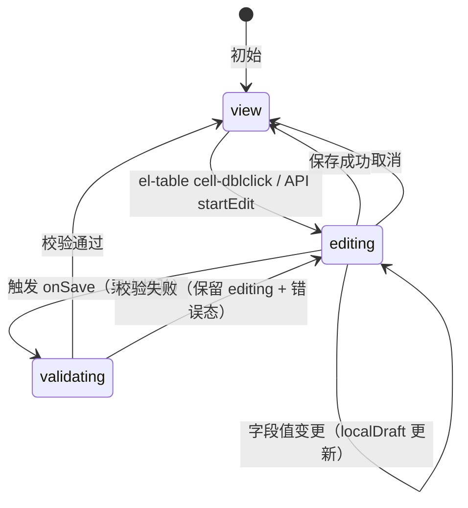
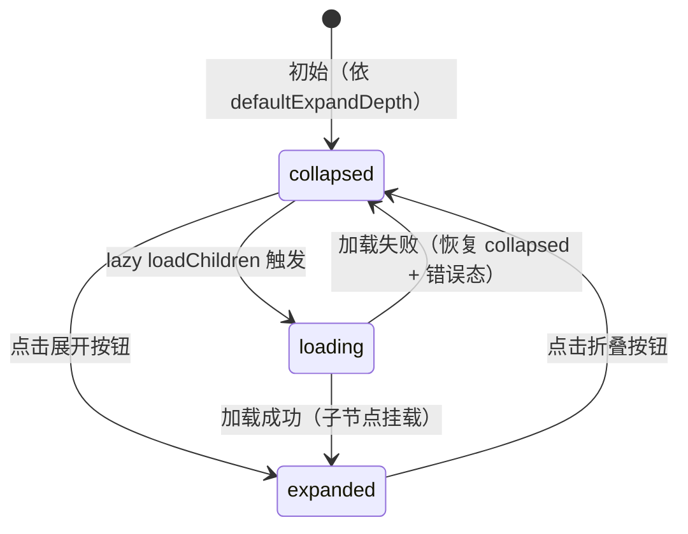
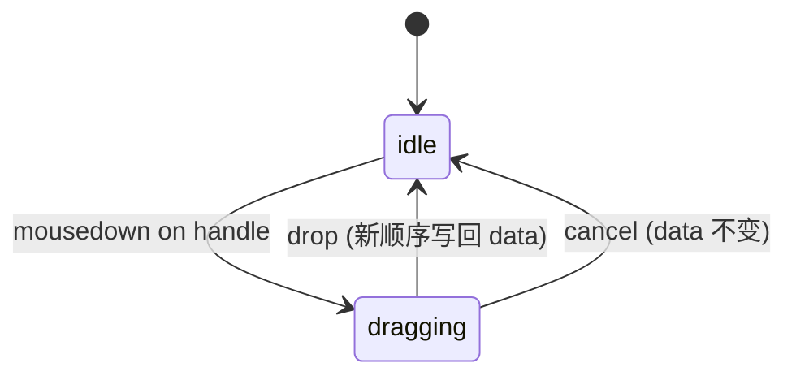

# ProTable v2.0 —— 4 类核心能力扩展

> **设计文档版本**：v1.0 | **生成日期**：2026-09-07 | **生效分支**：`fearute/pro-table`
> **承接**：v1.0（`2026-09-07-protable-design.md`）+ v1 第一轮交付（p0~p6 共 9 个 commit）

---

## 一、TL;DR

在 ProTable v1 的配置驱动 + 双引擎骨架基础上，补齐 **4 类核心能力**：

1. **行内编辑**（双击进入编辑态 + 保存/取消 + 校验联动）
2. **行拖拽排序**（sortablejs 拖拽 + 业务可拦截）
3. **树形数据**（懒加载子节点 + 搜索展开命中路径）
4. **单元格合并**（element-plus `spanMethod` 包装 + 自定义判定）

**关键约束**：
- 仅在 **element-plus 引擎**上落地；vxe-table 引擎适配延后到 v2.1
- 4 个能力**正交**，缺省 prop 不引入任何运行时开销
- 与 v1 架构完全一致 —— 4 个新 composable（`useRowEdit` / `useTreeData` / `useCellSpan` / `useRowDrag`），ProTable.vue 仅做编排

---

## 二、目标 & 非目标

### 2.1 目标（In Scope）

- 补齐企业级表格的 4 类杀手锏能力，让 ProTable v1 真正可用
- 保持 v1 的配置驱动 + 类型安全 + 单文件 ≤80 行约束
- 4 个能力互相正交 + 冲突规则明确（§七）
- 5 个 demo（4 能力独立 + Overview 升级）覆盖所有场景

### 2.2 非目标（Out of Scope）

- vxe-table 引擎适配（v2.1 议题）
- 服务端排序 / 服务端树形分页（v3 议题）
- 列冻结 + 列分组 + 列宽拖拽（v1 已有列设置抽屉，本版不扩展）
- 跨页多选编辑（编辑仅作用于当前页可见行）

---

## 三、整体架构

### 3.1 文件清单

```
src/components/ProTable/
├── ProTable.vue                     # 编排层（按 prop 启用能力，保持 ≤300 行）
├── composables/
│   ├── useSearch.ts                 # v1 已有，不动
│   ├── useColumns.ts                # v1 升级：列设置抽屉加 merge/drag 开关
│   ├── useTable.ts                  # v1 升级：data 改支持树形 + 编辑态
│   ├── useVxeTable.ts               # v1 骨架，v2.0 不动
│   ├── useRowEdit.ts                # 新增（≤80 行）
│   ├── useTreeData.ts               # 新增（≤80 行）
│   ├── useCellSpan.ts               # 新增（≤80 行）
│   └── useRowDrag.ts                # 新增（≤80 行）
├── components/                      # v1 子组件不动
└── types/index.ts                   # 扩展 ProColumn + ProTableProps + ProTableExpose
```

### 3.2 对外 props（4 个新能力开关）

| prop | 类型 | 触发 | 默认 |
|---|---|---|---|
| `enableRowEdit` | `boolean \| RowEditConfig` | 启用行内编辑 | `false` |
| `enableTree` | `boolean \| TreeConfig` | 启用树形数据 | `false` |
| `enableCellSpan` | `boolean \| CellSpanConfig` | 启用单元格合并 | `false` |
| `enableRowDrag` | `boolean \| RowDragConfig` | 启用行拖拽排序 | `false` |

### 3.3 核心原则

- 4 个能力互相**正交**（业务方可任意组合），冲突场景用显式规则解决（§七）
- vxe-table 引擎 v2.0 暂不实现这 4 个能力（README 标注为已知限制）
- 每个新 composable 自带 `.spec.ts`，新增 ≥ 30 用例（composable 单元）+ ≥ 18 用例（组件集成 + E2E）

---

## 四、类型扩展（types/index.ts）

### 4.1 ProColumn 新增字段

```typescript
/** 行内编辑配置 —— 列粒度控制哪些字段可编辑 @group ProTable 类型 */
export interface ColumnEditConfig {
  /** 编辑控件类型（input / select / input-number / 自定义组件名） */
  el: 'input' | 'select' | 'input-number' | string
  /** 编辑控件 props 透传 */
  props?: Record<string, unknown>
  /** 字段级校验规则（与 element-plus async-validator 对齐） */
  rules?: Record<string, unknown> | Record<string, unknown>[]
  /** 该字段是否可编辑（Ref 支持响应式，如根据行状态切换） */
  editable?: boolean | Ref<boolean>
}

/** 树形数据配置 —— 列粒度标识「该列展示树形缩进 + 展开/折叠」 @group ProTable 类型 */
export interface ColumnTreeConfig {
  /** 缩进占位宽度（默认 24px） */
  indentSize?: number
  /** 展开/折叠图标插槽名（默认 'expandIcon'） */
  expandSlot?: string
}

/** 单元格合并配置 —— 列粒度声明「该列参与合并」 @group ProTable 类型 */
export interface ColumnSpanConfig {
  /** 合并方向：纵向（同行多列）/ 横向（同列多行）/ both */
  direction: 'row' | 'column' | 'both'
  /** 自定义合并判定函数（不传则按相邻值相等自动合并） */
  judge?: (rowA: Record<string, unknown>, rowB: Record<string, unknown>) => boolean
}

export interface ProColumn {
  // ... v1 字段保留 ...

  /** 行内编辑配置（不声明 = 该列只读） */
  edit?: ColumnEditConfig
  /** 树形列声明（仅一列生效，默认第一列） */
  tree?: ColumnTreeConfig
  /** 单元格合并配置（不声明 = 该列不参与合并） */
  span?: ColumnSpanConfig
  /** 该列是否参与行拖拽（默认 false 不参与） */
  draggable?: boolean
}
```

### 4.2 ProTableProps 新增字段

```typescript
export interface ProTableProps {
  // ... v1 字段保留 ...

  /** 行内编辑（v2.0） */
  enableRowEdit?: boolean | RowEditConfig
  /** 树形数据（v2.0） */
  enableTree?: boolean | TreeConfig
  /** 单元格合并（v2.0） */
  enableCellSpan?: boolean | CellSpanConfig
  /** 行拖拽排序（v2.0） */
  enableRowDrag?: boolean | RowDragConfig
}

export interface RowEditConfig {
  /** 编辑触发方式：dblclick / manual（默认 'dblclick'） */
  trigger?: 'dblclick' | 'manual'
  /** 行保存钩子（返回 false 阻止保存；返回 Promise 等待异步校验） */
  onSave?: (row: Record<string, unknown>, changes: Record<string, unknown>) => boolean | Promise<boolean>
  /** 行保存成功回调 */
  onSaved?: (row: Record<string, unknown>) => void
  /** 行保存失败回调 */
  onSaveError?: (row: Record<string, unknown>, error: unknown) => void
}

export interface TreeConfig {
  /** 子节点懒加载方法（不传 = 一次性返回 children） */
  loadChildren?: (row: Record<string, unknown>) => Promise<Record<string, unknown>[]>
  /** 子节点字段名（默认 'children'） */
  childrenKey?: string
  /** 默认展开深度（默认 1） */
  defaultExpandDepth?: number
  /** 树形节点唯一 id 字段（默认 'id'） */
  rowKey?: string
  /** 是否显示连接线（默认 false） */
  showLine?: boolean
}

export interface CellSpanConfig {
  /** 全局合并判定（与列级 span.judge 二选一；列级优先） */
  judge?: (params: { row: Record<string, unknown>; column: ProColumn; rowIndex: number; columnIndex: number }) => { rowspan: number; colspan: number }
  /** 行表头是否参与合并（默认 false） */
  spanHeader?: boolean
  /** 同列相邻合并上限（默认 10；超过自动断开） */
  maxMergeSpan?: number
}

export interface RowDragConfig {
  /** 拖拽手柄列 prop（默认首列；'__all__' = 整行可拖） */
  handle?: string | '__all__'
  /** 排序变化回调（返回 false 阻止更新） */
  onSortChange?: (newOrder: Record<string, unknown>[]) => boolean | Promise<boolean>
}
```

### 4.3 ProTableExpose 新增

```typescript
export interface ProTableExpose {
  // ... v1 字段保留 ...

  // 行内编辑
  startEdit: (rowKey: string | number) => void
  cancelEdit: (rowKey?: string | number) => void  // 不传 = 取消所有
  saveEdit: (rowKey?: string | number) => Promise<boolean>  // 不传 = 保存所有

  // 树形
  expandNode: (rowKey: string | number, expanded?: boolean) => void
  collapseNode: (rowKey: string | number) => void
  refreshChildren: (rowKey: string | number) => Promise<void>

  // 行拖拽
  setRowOrder: (newOrder: Record<string, unknown>[]) => void
}
```

---

## 五、4 类能力设计

### 5.1 行内编辑（useRowEdit）

#### 状态机



#### 核心数据

```typescript
interface RowEditState {
  /** 当前正在编辑的行 key 集合（Set 支持多行同时编辑） */
  editingKeys: Set<string | number>
  /** 行级草稿（key → 字段路径 → 值），独立于表格 data */
  drafts: Map<string | number, Record<string, unknown>>
  /** 行级错误（key → 字段路径 → 错误信息） */
  errors: Map<string | number, Record<string, string>>
  /** 校验中状态（防止重复触发） */
  validating: Set<string | number>
}
```

**为什么 draft 独立于表格 data**：
- 取消编辑时不污染原数据（draft 丢弃）
- 保存成功才合并到表格 data
- 多行同时编辑互不干扰

#### composable API

```typescript
interface UseRowEditReturn {
  isEditing: (rowKey: string | number) => boolean
  getValue: (rowKey: string | number, field: string) => unknown
  setValue: (rowKey: string | number, field: string, value: unknown) => void
  getError: (rowKey: string | number, field: string) => string | undefined
  validate: (rowKey: string | number) => Promise<boolean>
  _start: (rowKey: string | number) => void
  _cancel: (rowKey: string | number) => void
  _save: (rowKey: string | number) => Promise<boolean>
}
```

#### 关键边界

| 场景 | 行为 |
|---|---|
| 编辑中切换分页 | draft 保留（绑定 rowKey，跨分页不丢失） |
| 编辑中触发搜索刷新 | **弹确认**「当前行未保存，是否放弃？」，确认则丢弃 draft + 刷新 |
| 编辑中触发列设置 / 密度切换 | 不影响 editing 状态 |
| 保存成功回调异步抛错 | catch 后进入 `validating → editing` 错误态，错误信息写入 `errors` |
| onSave 返回 false | 不合并草稿，保留 editing + 不写错误（业务自行提示） |
| 多行同时编辑 | 默认开（与 antd / element-pro 一致）；如需互斥传 `RowEditConfig.exclusive: true` |

### 5.2 树形数据（useTreeData）

#### 数据模型

**两态共存**：v1 的扁平 data 与树形 data 由 `enableTree` 切换，不可同时启用。

| 模式 | 数据来源 | useTable 行为 |
|---|---|---|
| 扁平（v1） | `requestApi(params)` 返回 `{ data, total }` | data = response.data |
| 树形（v2.0） | `requestApi(params)` 返回**完整树根** `{ data: TreeNode[] }` | data = 整棵树，本地展开/折叠 |

**树节点结构**：

```typescript
interface TreeNode extends Record<string, unknown> {
  id: string | number
  children?: TreeNode[]
  /** 内部状态字段（ProTable 注入，业务不应读写） */
  _hasChildren?: boolean
  _loaded?: boolean
  _level?: number
}
```

#### 状态机



#### Lazy Load 协议

```typescript
interface TreeConfig {
  loadChildren?: (row: TreeNode) => Promise<TreeNode[]>
}
```

**触发条件**：
- 用户点击展开按钮且 `_loaded === false`
- 自动调用 `loadChildren(row)`，loading 态展示
- 成功：写入 `row.children` + `_loaded = true`，保持展开
- 失败：console.error + 保留 collapsed + 不弹错误（由 `requestError` 统一捕获）

**与 SearchForm 搜索区的交互**：
- 树形模式下，SearchForm 提交后改为「客户端遍历整棵树匹配 + 自动展开命中路径」
- 命中节点的所有祖先节点自动展开
- `_hasChildren = true` 但未加载的节点：搜索命中时自动触发 lazy load（不阻塞当前匹配）

#### 关键边界

| 场景 | 行为 |
|---|---|
| 默认展开深度 defaultExpandDepth = 0 | 全部折叠 |
| 默认展开深度 = Infinity | 全部展开（递归懒展开，仅初始可见） |
| 搜索命中节点未加载 | 自动触发 loadChildren，不阻塞搜索 |
| 树形 + 列设置 | 列设置对树形列无效（树形列必有） |
| 树形 + 单元格合并 | 列级 `span.direction: 'column'`（横向合并）禁用 —— 启动校验自动改为 'row' + console.warn |
| 树形 + 行拖拽 | 同层拖拽允许，跨层拖拽默认禁用 |

#### composable API

```typescript
interface UseTreeDataReturn {
  normalize: (data: Record<string, unknown>[]) => TreeNode[]
  isExpanded: (rowKey: string | number) => boolean
  toggle: (rowKey: string | number) => Promise<void>
  expandAll: () => void
  collapseAll: () => void
  revealKeys: (matchedKeys: Set<string | number>) => Promise<void>
}
```

### 5.3 单元格合并（useCellSpan）

#### 核心机制

element-plus ElTable 提供 `span-method` 属性：`(params) => { rowspan, colspan }`。我们为业务方生成这个函数。

```typescript
type SpanMethod = (params: {
  row: Record<string, unknown>
  column: ElTableColumn
  rowIndex: number
  columnIndex: number
}) => { rowspan: number; colspan: number }
```

#### 三种合并模式

**A. 同列相邻值相等 → 纵向合并**（自动判定）

```typescript
// 列声明：span: { direction: 'row' }
// 默认行为：相邻 row 同列值相等则合并
```

**B. 自定义判定函数**

```typescript
// 列声明：span: { direction: 'both', judge: (a, b) => a.dept === b.dept }
```

**C. 跨列合并**（`colspan > 1`）

```typescript
// 列声明：span: { direction: 'column' } + 列渲染逻辑串联
// 业务方通过 _spanTarget 字段标记「我合并到上一列」
```

#### 实现要点

```typescript
interface UseCellSpanReturn {
  spanMethod: SpanMethod
  prevValueCache: WeakMap<Record<string, unknown>, unknown>
  resetCache: () => void
}
```

**性能考虑**：
- N 行 × M 列 = NM 次函数调用 → 缓存前一行值（同列相邻比较）
- 列级 judge + 全局 judge 二选一时优先列级
- 默认仅合并相邻 2~10 行（防止单列全表合并成 1 行 → UX 灾难）

#### 关键边界

| 场景 | 行为 |
|---|---|
| 多列同时声明 span.direction = 'row' | 各自独立合并 |
| 合并单元格 + 编辑 | editing 行的合并单元格**不展开编辑** |
| 合并 + 拖拽 | 拖拽后重新计算 span（resetCache + doLayout） |
| 合并 + 树形 | 跨层节点不合并；'column' 方向禁用 → 启动校验自动改为 'row' |

### 5.4 行拖拽排序（useRowDrag）

#### 实现机制

直接复用项目已有的 `sortablejs ^1.15.7`（v1 README 已列入依赖）。element-plus ElTable 的 `<tbody>` DOM 节点挂 sortable 实例：

```typescript
import Sortable from 'sortablejs'

const sortable = Sortable.create(tbodyEl, {
  handle: handleSelector,  // 默认 '.pro-table-drag-handle'
  animation: 150,
  onEnd: (evt) => { /* ... */ }
})

// 组件卸载 onScopeDispose 销毁
onScopeDispose(() => sortable.destroy())
```

#### 状态机



#### 与 onSortChange 集成

```typescript
const handleDrop = async (oldIdx: number, newIdx: number) => {
  const newOrder = [...data.value]
  const [moved] = newOrder.splice(oldIdx, 1)
  newOrder.splice(newIdx, 0, moved)

  const allowed = await config.onSortChange?.(newOrder)
  if (allowed === false) return

  data.value = newOrder
}
```

#### 关键边界

| 场景 | 行为 |
|---|---|
| 编辑中行不可拖 | draggable 列不在 editing 行显示拖拽手柄 |
| 合并单元格 + 拖拽 | 拖拽后调 `elTableRef.doLayout()` 重算 spanMethod |
| 树形 + 拖拽 | 仅同层拖拽；跨层拖拽 sortablejs `onMove` 拦截 |
| 拖拽 + 搜索刷新 | 搜索后顺序重置（服务端重新分页，新 data） |
| onSortChange 返回 Promise | 等待异步确认；loading 态阻止重复拖拽 |

#### composable API

```typescript
interface UseRowDragReturn {
  sortableRef: ShallowRef<Sortable | null>
  handleClass: string
  isDragging: Ref<boolean>
}
```

---

## 六、ProTable.vue 编排设计

### 6.1 setup 流程

```typescript
const props = defineProps<ProTableProps>()

// v1 composables（保持不动）
const search = useSearch(props.columns)
const columns = useColumns(props.columns, props.tableKey)
const table = useTable({ props, search, columns })

// v2.0 新增（条件启用）
const rowEdit = props.enableRowEdit ? useRowEdit({ props, table }) : null
const treeData = props.enableTree ? useTreeData({ props, table }) : null
const cellSpan = props.enableCellSpan ? useCellSpan({ props, table }) : null
const rowDrag = props.enableRowDrag ? useRowDrag({ props, table }) : null

// 启动校验
onMounted(() => _validateCapabilities(props))
```

### 6.2 模板条件渲染

```vue
<el-table
  :data="table.data.value"
  :span-method="cellSpan?.spanMethod"
  @cell-dblclick="rowEdit?._start(rowKey(row))"
>
  <!-- 列渲染 -->
  <el-table-column
    v-for="col in columns.sortedColumns.value"
    :key="col.prop"
    :prop="col.prop"
    :label="col.label"
    :width="col.width"
  >
    <template #default="{ row, $index }">
      <!-- 树形缩进 -->
      <span v-if="col.tree && treeData" :style="{ paddingLeft: ... }">
        <button v-if="hasChildren(row)" @click="treeData.toggle(row.id)">▾</button>
        {{ getValue(rowEdit, row, col.prop) }}
      </span>
      <!-- 编辑控件 / 普通文本 -->
      <component
        v-else-if="rowEdit?.isEditing(rowKey(row)) && col.edit"
        :is="resolveEditComp(col.edit.el)"
        v-model="rowEdit.getValue(rowKey(row), col.prop)"
      />
      <!-- 合并 / 普通 -->
      <span v-else>{{ formatCell(row, col) }}</span>
    </template>
  </el-table-column>
</el-table>
```

### 6.3 行数预算

- v1 ProTable.vue 303 行 → v2.0 预计 380~420 行
- 超过 400 行时**按 CLAUDE.md §二.6 拆分为 `useTableRender.ts` 模板渲染 composable**

---

## 七、能力冲突规则

### 7.1 冲突矩阵

| | 行内编辑 | 树形 | 合并 | 拖拽 |
|---|---|---|---|---|
| **行内编辑** | — | ① | ② | ③ |
| **树形** | ① | — | ④ | ⑤ |
| **合并** | ② | ④ | — | ⑥ |
| **拖拽** | ③ | ⑤ | ⑥ | — |

### 7.2 冲突规则

**① 编辑 + 树形**：编辑仅作用于叶子节点
- 非叶子节点的编辑按钮禁用 + tooltip「非叶子节点不可编辑」

**② 编辑 + 合并**：editing 行的合并单元格不展开编辑控件
- 合并格保留文本态；同列未合并的其他行可编辑

**③ 编辑 + 拖拽**：拖拽手柄不在 editing 行显示
- editing 行：删除手柄 DOM，只保留编辑控件

**④ 树形 + 合并**：跨层节点不合并（仅同层）
- `span.direction: 'column'`（横向合并）禁用 —— 启动校验自动改为 'row' + console.warn

**⑤ 树形 + 拖拽**：仅同层拖拽
- sortablejs `onMove` 拦截跨层拖拽

**⑥ 合并 + 拖拽**：拖拽后重新计算 spanMethod
- 拖拽成功回调里调 `useCellSpan.resetCache()` + `elTableRef.doLayout()`

### 7.3 启动校验（onMounted）

```typescript
function _validateCapabilities(props: ProTableProps) {
  if (props.enableRowEdit && props.enableTree && !props.enableTree.exclusive) {
    console.warn('[ProTable] enableRowEdit + enableTree: 编辑仅作用于叶子节点')
  }
  if (props.enableCellSpan?.direction === 'column' && props.enableTree) {
    console.warn('[ProTable] 树形模式下禁用 span.direction=column，已自动改为 row')
    props.enableCellSpan.direction = 'row'
  }
}
```

**只 warn 不 throw**：业务可读到警告 + 自定义；不让 ProTable 强制 throw 阻断启动。

### 7.4 三能力全开渲染优先级

```text
1. 树形缩进（仅树形列，最左）
2. 拖拽手柄（仅 draggable 列，仅非 editing 行）
3. 合并单元格内的文本（合并 + 非编辑）
4. 编辑控件（编辑态 + 未合并 + 含 edit 声明）
5. 普通文本（无 edit 声明 + 非合并）
```

各 composable 之间**不直接调用**，只通过 ProTable.vue 的模板协调。

---

## 八、Demo 矩阵

### 8.1 5 个 demo 清单

| demo | 路径 | 演示能力 | 行数预算 |
|---|---|---|---|
| **ProTableOverview**（升级） | `/demo/pro-table-overview` | 4 类能力开关面板 + 场景对比 | ≤200 行 |
| **ProTableRowEdit** | `/demo/pro-table-row-edit` | 行内编辑：双击 / 多行并行 / 保存校验 / 取消恢复 | ≤250 行 |
| **ProTableTree** | `/demo/pro-table-tree` | 树形数据：懒加载 + 搜索展开 + 默认展开 + 折叠 | ≤250 行 |
| **ProTableCellSpan** | `/demo/pro-table-cell-span` | 单元格合并：纵向合并 / 跨列合并 / 自定义判定 | ≤200 行 |
| **ProTableRowDrag** | `/demo/pro-table-row-drag` | 行拖拽：手柄拖拽 / 整行拖拽 / 业务拦截 | ≤200 行 |

### 8.2 ProTableOverview 升级方案

在 v1 基础上增加「能力切换面板」：

```vue
<template>
  <ProTable
    :columns="columns"
    :request-api="requestApi"
    :enable-row-edit="config.rowEdit"
    :enable-tree="config.tree"
    :enable-cell-span="config.cellSpan"
    :enable-row-drag="config.rowDrag"
    :table-key="configKey"
  />
  <CapabilityPanel v-model="config" />
</template>
```

能力面板提供：4 个 toggle 开关 + 「全开」按钮 + 「恢复默认」按钮。

### 8.3 各 demo 数据设计

**ProTableRowEdit**：员工列表（姓名 / 部门 / 工资 / 入职日期 / 操作）
- 字段声明：`name.edit.rules = [{required:true}]`、`salary.edit.props.precision = 2`
- 场景：双击进入编辑 / 多行同时编辑 / 异步校验 / 编辑中切分页

**ProTableTree**：组织架构（公司 / 部门 / 小组 / 员工 4 层）
- `loadChildren`：mock 200ms 延迟返回下一层
- 场景：默认展开第 1 层 / lazy load / 搜索命中路径 / 折叠全部

**ProTableCellSpan**：订单列表（订单号 / 商品 / 数量 / 状态）
- 场景：状态列相同相邻自动纵向合并 / 商品列自定义 judge / 跨列合并

**ProTableRowDrag**：待办任务列表
- 场景：默认手柄列拖拽 / 切换为整行拖拽 / 业务拦截

### 8.4 mock 数据规范

```text
mock/pro-table/
├── employee.ts          # 行内编辑 demo 数据
├── org-chart.ts         # 树形 demo 数据（4 层结构）
├── orders.ts            # 合并 demo 数据
└── tasks.ts             # 拖拽 demo 数据
```

### 8.5 引导卡（XForm 风格）

每个 demo 顶部加 `el-alert` 引导卡：能力名 + 一句话定位 + 关键场景列表 + 关联 API 文档链接。

---

## 九、错误处理与性能

### 9.1 错误矩阵新增（v2.0 特有）

| # | 场景 | 处理 |
|---|---|---|
| 14 | 行内编辑保存异步抛错 | catch + console.error + 进入 editing 错误态 |
| 15 | 行内编辑字段级校验失败 | errors[field] = 错误信息 + 字段下方红字 |
| 16 | 树形 lazy load 失败 | console.error + 保持 collapsed + 不弹窗 |
| 17 | 树形搜索命中未加载节点 lazy load 失败 | console.error + 该节点不展开（不阻塞其他命中） |
| 18 | 单元格合并循环引用 judge | 启动期 console.warn + 降级为「不相等即不合并」 |
| 19 | 行拖拽 onSortChange 抛错 | catch + console.error + 顺序回滚 + toast |
| 20 | 行拖拽目标索引越界 | 跳过 + console.warn |
| 21 | 能力冲突（§七矩阵违规） | 启动期 console.warn，组件正常启动 |

加上 v1 的 13 条共 **21 条**错误处理矩阵。

### 9.2 错误处理铁律

- **不静默吞错**：所有 catch 块必须有 console.error + 业务侧反馈（toast / 错误态）
- **业务可拦截**：onSave / onSortChange 返回 false 视为业务主动拒绝，不算错误
- **不阻断组件**：能力组合警告不 throw

### 9.3 性能策略

| 场景 | 策略 | 量化指标 |
|---|---|---|
| 行内编辑多行（50+） | draft Map 按需创建 + Set 跟踪 | 100 行同时编辑 O(1) 切换 |
| 树形 lazy load 并发 | 同节点 200ms 防抖 | 同一节点 1s 内多次点击只触发 1 次请求 |
| 单元格合并 NM 次调用 | WeakMap 缓存前一行值 | 1000 行 × 10 列 < 5ms |
| 行拖拽 sortablejs | 限制单页拖拽行数（>500 提示虚拟滚动） | sortablejs 原生支持 1000+ 行流畅 |
| useCellSpan 重算 | 拖拽后 resetCache + doLayout | 单次重算 < 16ms（60fps） |

### 9.4 防御性 UI 三态

| 状态 | 行内编辑 | 树形 | 合并 | 拖拽 |
|---|---|---|---|---|
| Loading | 编辑控件 disabled + loading 图标 | 展开按钮 spinner | 合并格骨架 | 手柄 disabled |
| Error | 字段红字 + 行错误高亮 | 节点保留 collapsed | ⚠️ + tooltip | 拖拽失败 toast |
| Empty | 编辑按钮 disabled | 空状态占位 | 显示「-」 | 手柄 disabled |

---

## 十、测试策略

### 10.1 测试分层与预算

| 层 | 覆盖目标 | 工具 | 用例预算 |
|---|---|---|---|
| 单元（composable spec） | 4 个新 composable 纯逻辑 | vitest | ≥ 30 用例 |
| 组件（demo spec） | ProTableOverview 能力面板 + 4 个 demo | vitest + happy-dom | ≥ 10 用例 |
| 集成（ProTable.vue spec） | 4 能力组合 + 冲突规则 | vitest + happy-dom | ≥ 8 用例 |
| E2E（demo 浏览器验证） | 5 个 demo 真实交互 | chrome-devtools mcp | 5 流程 |

**合计新增 ≥ 48 用例**（v1 共 30 个 → v2.0 至少 78 个）。

### 10.2 composable spec 覆盖矩阵

| composable | 必测用例 | 用例数 |
|---|---|---|
| `useRowEdit` | editingKeys Set / draft Map / validate 同步+异步 / cancel 回滚 / 多行独立 / 校验错误态 | 8 |
| `useTreeData` | normalize 扁平→树 / isExpanded / toggle 异步 lazy / expandAll + collapseAll / revealKeys / 默认展开深度 / 加载失败 | 8 |
| `useCellSpan` | 同列相邻相等自动合并 / judge 自定义 / 跨列合并 / 重置缓存 / 合并上限 / 跨层不合并 | 7 |
| `useRowDrag` | sortable 实例创建+销毁 / handle 选择器 / onEnd / onMove 跨层拦截 / onSortChange 拦截 / 索引越界 | 8 |

### 10.3 ProTable.vue 集成 spec

| 用例 | 验证 |
|---|---|
| 编辑 + 树形：非叶子节点编辑按钮禁用 | DOM 查询 + tooltip 内容 |
| 编辑 + 合并：合并格不展开编辑 | DOM 结构断言 |
| 编辑 + 拖拽：editing 行无手柄 | DOM 结构断言 |
| 树形 + 合并：跨层不合并 | 渲染快照对比 |
| 树形 + 拖拽：跨层拖拽拒绝 | sortable onMove 触发 |
| 合并 + 拖拽：拖拽后重算 | resetCache + spanMethod 重跑 |
| 启动校验：能力冲突 warn | console.warn 断言 |
| 三能力全开：渲染优先级 | DOM 顺序断言 |

### 10.4 E2E 浏览器验证

| demo | 验证流程 |
|---|---|
| ProTableOverview | 切换 4 能力开关 → 表格实时变化 → 一键全开 → 恢复默认 |
| ProTableRowEdit | 双击姓名 → 编辑控件出现 → 输入 → 保存 → 数据更新 |
| ProTableTree | 点击展开按钮 → 加载子节点 → 搜索「张三」→ 命中路径自动展开 |
| ProTableCellSpan | 默认合并 → 自定义 judge → 跨列合并 → 视觉对比 |
| ProTableRowDrag | 拖拽第 1 行到第 3 位 → 数据顺序变化 → 取消后回滚 |

### 10.5 测试质量铁律

- 单 composable ≥ 6 用例
- 所有错误场景（§九.1 #14-#21）必须有对应测试
- 冲突矩阵 6 条必须全部覆盖
- demo 必跑通浏览器（单测只覆盖数据流，UI 交互必须浏览器验证）

---

## 十一、交付清单

### 11.1 新增文件

| 文件 | 用途 | 行数预算 |
|---|---|---|
| `src/components/ProTable/composables/useRowEdit.ts` | 行内编辑状态机 | ≤80 |
| `src/components/ProTable/composables/useRowEdit.spec.ts` | 行内编辑单测 | ≥8 用例 |
| `src/components/ProTable/composables/useTreeData.ts` | 树形数据 | ≤80 |
| `src/components/ProTable/composables/useTreeData.spec.ts` | 树形单测 | ≥8 用例 |
| `src/components/ProTable/composables/useCellSpan.ts` | 单元格合并 | ≤80 |
| `src/components/ProTable/composables/useCellSpan.spec.ts` | 合并单测 | ≥7 用例 |
| `src/components/ProTable/composables/useRowDrag.ts` | 行拖拽排序 | ≤80 |
| `src/components/ProTable/composables/useRowDrag.spec.ts` | 拖拽单测 | ≥8 用例 |
| `src/modules/demo/examples/ProTable/ProTableRowEdit.vue` | 编辑 demo | ≤250 |
| `src/modules/demo/examples/ProTable/ProTableTree.vue` | 树形 demo | ≤250 |
| `src/modules/demo/examples/ProTable/ProTableCellSpan.vue` | 合并 demo | ≤200 |
| `src/modules/demo/examples/ProTable/ProTableRowDrag.vue` | 拖拽 demo | ≤200 |
| `mock/pro-table/employee.ts` | 编辑 mock | ≤60 |
| `mock/pro-table/org-chart.ts` | 树形 mock | ≤80 |
| `mock/pro-table/orders.ts` | 合并 mock | ≤60 |
| `mock/pro-table/tasks.ts` | 拖拽 mock | ≤60 |

### 11.2 修改文件

| 文件 | 变更 |
|---|---|
| `src/components/ProTable/types/index.ts` | 新增 ColumnEditConfig / ColumnTreeConfig / ColumnSpanConfig + 4 个 enableXxx prop + 8 个 Expose 方法 |
| `src/components/ProTable/ProTable.vue` | 编排 4 个新 composable + 启动校验 + 模板条件渲染 |
| `src/components/ProTable/composables/useTable.ts` | data 支持树形 + 编辑态 |
| `src/components/ProTable/composables/useColumns.ts` | 列设置抽屉加 merge / drag 开关 |
| `src/modules/demo/examples/ProTable/ProTableOverview.vue` | 升级：加能力切换面板 + 引导卡 |
| `CHANGELOG.md` | 记录 v2.0 新特性 |

### 11.3 文档更新

| 文件 | 变更 |
|---|---|
| `src/components/ProTable/README.md` | 新增 4 类能力 API + 5 个 demo 链接 + vxe-table 已知限制 |
| `src/components/ProTable/ARCHITECTURE.md` | 数据流图升级 + composables 表 + 状态归属表 |

---

## 十二、风险与回退

### 12.1 主要风险

| 风险 | 影响 | 缓解 |
|---|---|---|
| ProTable.vue 超过 400 行上限 | 违反 CLAUDE.md §二.6 | 抽 `useTableRender.ts` 模板渲染 composable |
| sortablejs + element-plus ElTable 兼容 | 拖拽失效 | 复用 v1 已验证的 sortablejs 依赖 |
| 4 能力全开性能 | 大数据卡顿 | 性能基准测试 + 虚拟滚动提示 |
| vxe-table 引擎未来适配 | 工作量未评估 | v2.0 不动 vxe-table 骨架，v2.1 独立议题 |

### 12.2 回退预案

每能力独立 commit，任意能力问题可单独 revert：
- commit 1：`feat(ProTable): v2.0 类型扩展 + useRowEdit`
- commit 2：`feat(ProTable): v2.0 useTreeData + 树形 demo`
- commit 3：`feat(ProTable): v2.0 useCellSpan + 合并 demo`
- commit 4：`feat(ProTable): v2.0 useRowDrag + 拖拽 demo`
- commit 5：`docs(ProTable): v2.0 README + CHANGELOG`

---

**文档版本**：v1.0 | **生成日期**：2026-09-07 | **生效分支**：`fearute/pro-table`
