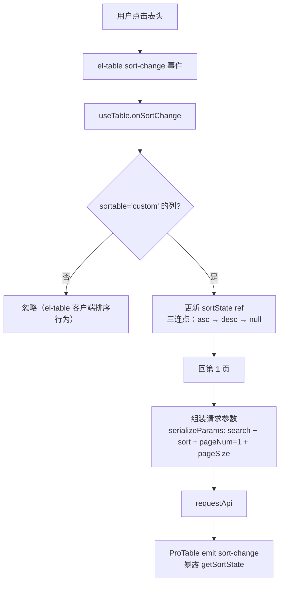

# ProTable 下一迭代设计：泛型地基 + 服务端排序 + 响应适配器

> 版本：v1.0.0 | 日期：2026-09-08 | 分支：`fearute/pro-table` | 状态：已批准（用户拍板方案 A）
> 前置：架构优化 5 步计划已全部完成（见 `docs/superpowers/plans/2026-09-08-protable-arch-refactor.md`）
> 范围边界：v2.1 vxe-table 引擎保持独立迭代，本设计不涉及；Excel 导出明确不做（YAGNI）；列筛选仅透传事件，不做内置参数合并。

---

## 1. 背景与目标

### 1.1 现状基线（2026-09-08）

- 功能面：搜索表单、列设置（localStorage 持久化）、分页、行内编辑、树形、单元格合并、行拖拽、密度、9 类插槽
- 质量面：14 个 spec 约 95 用例全绿，`type-check:full` + lint 零错误
- 类型面：**全部 API 基于 `Record<string, unknown>`**——`render` 回调的 row 无类型、prop 无补全，接真实业务类型时 DX 痛点明显
- 排序面：`ProColumn.sortable` 仅透传布尔值给 ElTableColumn（`ProTable.vue:279`），**服务端排序未接线**——真实后端大表几乎全为服务端排序，这是接真实业务的第一道坎
- 响应面：`ProTableResponse { data, total, pageNum, pageSize }` 固定结构，非此约定的后端无法接入

### 1.2 迭代目标

| # | 目标 | 价值维度 |
|---|------|----------|
| G1 | 泛型化 `ProColumn<T>` / `ProTableProps<T>`，render row 精确到 T、prop IDE 补全 | 开发场景（DX） |
| G2 | 服务端排序能力（`sortable: 'custom'` 接线 + 参数序列化适配） | 真实业务场景 |
| G3 | `responseAdapter` 响应结构适配器 + fail-fast 校验 | 真实业务场景 |

### 1.3 非目标（本迭代明确不做）

- vxe-table 引擎（v2.1 独立迭代）
- Excel 导出（依赖引入 + 需求差异大，YAGNI）
- 列筛选内置参数合并（仅透传 `filter-change` 事件）
- 现有 demo / spec 的强制泛型化迁移（T 有默认值，向后兼容，存量代码零改动）

---

## 2. 关键设计决策

| # | 决策点 | 拍板结论 | 备选与拒绝理由 |
|---|--------|----------|----------------|
| D1 | `ProColumn.prop` 类型 | `Extract<keyof T, string> \| string` 联合 string | 严格 `keyof T`：`'operation'` 等特殊列 prop 会类型报错，需额外判别联合，复杂度不值；纯 `string`：无补全收益 |
| D2 | 排序参数序列化形态 | 内部默认 `{ orderByColumn: prop, isAsc: 'asc'\|'desc' }`（国产后台最常用约定）+ `sortParamsAdapter` 回调改键名 | 只透传 el-table 原生 `{ prop, order }`：与常见后端约定不符，每个业务方都要自己写转换 |
| D3 | 筛选范围 | 本迭代仅透传 `filter-change` 事件，不做参数合并 | 内置筛选参数合并：filters 配置 + 多列组合筛选的序列化约定分歧大，真实需求出现再立项 |
| D4 | 排序状态归属 | `useTable` 内部 ref，**不混入** `useSearch.searchParams` | 混入 searchParams：排序不是表单输入，会污染 `getSearchParams()` 语义（spec 已承诺其返回纯表单参数） |
| D5 | adapter 非法返回值处理 | `console.error` + 抛错（fail-fast） | warn + 降级渲染空表：静默吞错误，违反项目错误处理规范 |

---

## 3. 详细设计

### 3.1 泛型化（里程碑 M1）

**核心形态**：

```ts
export interface ProColumn<T extends object = Record<string, unknown>> {
  /** 字段名 —— IDE 优先补全 T 的键；联合 string 放行 'operation' 等特殊列（决策 D1） */
  prop: Extract<keyof T, string> | string
  render?: (scope: { row: T; column: ProColumn<T>; $index: number }) => VNode
  headerRender?: (scope: { column: ProColumn<T>; $index: number }) => VNode
  edit?: ColumnEditConfig
  span?: ColumnSpanConfig
  tree?: ColumnTreeConfig
  // ...其余字段不变（enum/search/tableProps 等不依赖 T）
}

export interface ProTableResponse<T extends object = Record<string, unknown>> {
  data: T[]
  total: number
  pageNum: number
  pageSize: number
}

export interface ProTableProps<T extends object = Record<string, unknown>> {
  columns: ProColumn<T>[]
  requestApi: (params: Record<string, unknown>) => Promise<ProTableResponse<T>>
  responseAdapter?: (raw: unknown) => ProTableResponse<T>
  // ...既有字段不变
}

export interface ProTableExpose<T extends object = Record<string, unknown>> {
  getSelectedRows: () => T[]
  // ...既有字段泛型化
}
```

**组件侧**：`ProTable.vue` 声明 `generic="T extends object"`（Vue 3.5 泛型 SFC），`defineProps<ProTableProps<T>>()`。

**泛型传播路径**（改签名不改运行时）：

```text
types/index.ts → ProTable.vue (generic + defineProps) → index.ts barrel
  → composables（useTable/useColumns/useSearch/useRowEdit/useTreeData/useCellSpan/useRowDrag/useTableCapabilities 的泛型参数补齐）
  → components/EditCell.vue、CellContent.vue（props 类型）
```

**向后兼容保证**：所有泛型参数默认 `Record<string, unknown>`（即现状），存量 demo / spec / 业务调用**零改动**。是否迁移存量 demo 为泛型写法：仅 `ProTableServerSort` 新 demo 用泛型，存量 demo 不动（控制改动面）。

### 3.2 服务端排序（里程碑 M2）

**数据流**：



**类型与 API 增量**：

```ts
export interface ProColumn<T> {
  /** 是否可排序 —— true 客户端排序；'custom' 服务端排序（决策接线） */
  sortable?: boolean | 'custom'
}

export interface ProTableProps<T> {
  /** 排序参数序列化适配（决策 D2）；缺省用内置 { orderByColumn, isAsc } */
  sortParamsAdapter?: (state: SortState<T>) => Record<string, unknown>
}

/** 排序状态 —— null 表示未排序（第三击清除） */
export interface SortState<T> {
  prop: Extract<keyof T, string> | string
  order: 'ascending' | 'descending'
}

// ProTableExpose 增量
getSortState: () => SortState<T> | null
```

**实现要点**：

- `useTable` 内部新增 `sortState = ref<SortState | null>(null)` 与 `onSortChange`（eager 暴露，供 ProTable.vue 模板 `@sort-change` 绑定）
- 请求组装处（M2 前已单源化在 useTable）：`serializeParams({ ...getSearchParams(), ...serializedSort, pageNum: 1, pageSize })`——注意排序变化强制回第 1 页，与 `setSearchParams` 同语义
- `sortState` 为 null 时不产生排序参数（不给后端传空键）
- 多列排序：v2.0 只支持单列排序（el-table 默认），多列排序列入 TODO 不进本迭代

### 3.3 响应结构适配器（里程碑 M3）

**实现位置**：`useTable` 内 requestApi 调用之后、`dataCallback` 之前：

```text
requestApi(params) → responseAdapter(raw) → 结构校验（fail-fast）→ data/total 落状态 → dataCallback
```

**校验规则（决策 D5）**：

```ts
function assertValidResponse<T>(result: ProTableResponse<T>): void {
  if (!Array.isArray(result.data) || typeof result.total !== 'number') {
    // console.error + throw —— 不静默吞，违反即开发期报错
  }
}
```

- adapter 默认恒等函数（现状行为不变）
- `pageNum/pageSize` 不做强制校验（后端常省略，组件内用自身分页状态）

---

## 4. 测试策略

| 里程碑 | 测试增量 | 类型 |
|--------|----------|------|
| M1 | 类型级测试：`expectTypeOf` 验证 `ProColumn<User>` 的 prop 补全、render row 类型、向后兼容默认 T；95 用例全量回归（证明运行时零变化） | spec + type-level |
| M2 | `useTable.spec`：sort-change 更新 sortState；排序参数进入请求体（内置序列化 + 自定义 adapter 两种）；三连点清除；排序回第 1 页。集成测试：点击表头 → requestApi 收到排序参数；非 custom 列不触发 | 行为 |
| M3 | `useTable.spec`：自定义结构经 adapter 映射成功；非法结构（data 非数组 / total 非数字）抛错；恒等默认行为回归 | 行为 |

新 demo `ProTableServerSort.vue`：泛型列定义 + `sortable: 'custom'` + 自定义 `responseAdapter` + `sortParamsAdapter` 四能力合一展示，mock 后端带排序回显。

---

## 5. 文件影响清单

| 文件 | M1 | M2 | M3 |
|------|----|----|----|
| `types/index.ts` | ★ 泛型化 + SortState + sortable 扩展 + 新 props | ★ | ★（responseAdapter） |
| `ProTable.vue` | ★ generic 声明 | ★ @sort-change 接线 + emit | — |
| `composables/useTable.ts` | ★ 泛型签名 | ★ sortState + 组装合并 | ★ adapter 调用 + 校验 |
| 其余 composables | ★ 泛型签名传播 | — | — |
| `components/EditCell.vue` / `CellContent.vue` | ★ props 泛型 | — | — |
| `index.ts` barrel | ★ 新类型导出 | ★ | ★ |
| `useTable.spec.ts` / `ProTable.integration.spec.ts` | 回归 | ★ 新增用例 | ★ 新增用例 |
| `modules/demo/examples/ProTable/ProTableServerSort.vue` | — | ★ 新增 | — |
| `README.md` / `ARCHITECTURE.md` | ★ 泛型用法章节 | ★ 排序章节 | ★ adapter 章节 |

---

## 6. 里程碑与验收

| 里程碑 | 内容 | 验收门槛（沿用架构优化计划纪律） |
|--------|------|------|
| M1 泛型化 | 类型层改造 + 泛型 SFC | `pnpm test src/components/ProTable` 全绿 + `pnpm type-check:full` + `pnpm lint`；存量调用零改动（git diff 中 demo/spec 无被迫修改） |
| M2 服务端排序 | sortState + 接线 + 序列化 | M1 门槛 + useTable.spec/集成测试新增用例全绿 + 浏览器手动验证 `ProTableServerSort` demo |
| M3 响应适配器 | adapter + fail-fast | M2 门槛 + 新增用例全绿 |

顺序不可调换（M1 在前保证 M2/M3 的新 API 签名基于泛型一次成型）。

---

## 7. 风险与对策

| 风险 | 对策 |
|------|------|
| 泛型改造引入意外类型破坏 | M1 单独成里程碑，95 用例 + vue-tsc 全量回归；类型级测试锁死关键类型断言 |
| Vue 3.5 泛型 SFC 与 vue-tsc 版本兼容问题 | M1 第一步先改 ProTable.vue 单点验证 `type-check:full`，失败则回退「组件不泛型、仅 ProColumn 泛型 + 调用方类型断言」降级方案 |
| 排序参数约定与目标后端不符 | `sortParamsAdapter` 回调兜底；内置约定选择国产后台最大公约数 |
| adapter 抛错影响线上 | adapter 为开发期装配代码（非用户输入路径），fail-fast 优于静默——对齐项目「不静默吞错误」规范 |

## 8. TODO（本迭代沉淀，后续立项）

- 多列排序（el-table `sortOrders` / vxe 原生支持更好，建议随 v2.1 vxe 引擎评估）
- 列筛选内置参数合并（待真实需求）
- Excel 导出（待真实需求）
- 存量 demo 泛型化迁移（可选，不做不损失）
