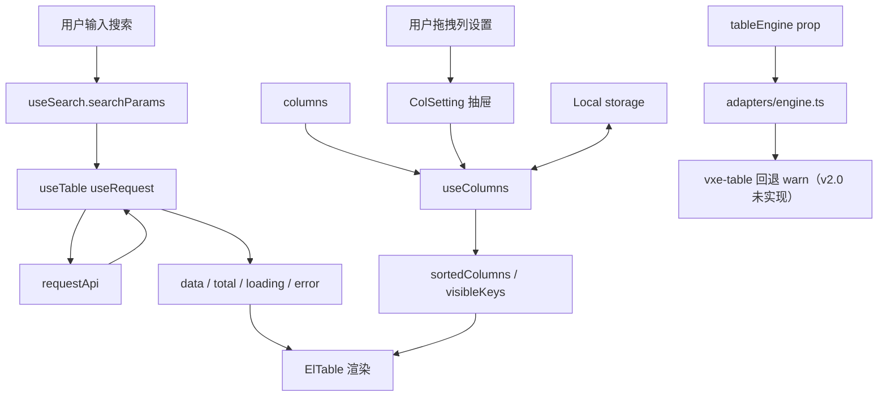
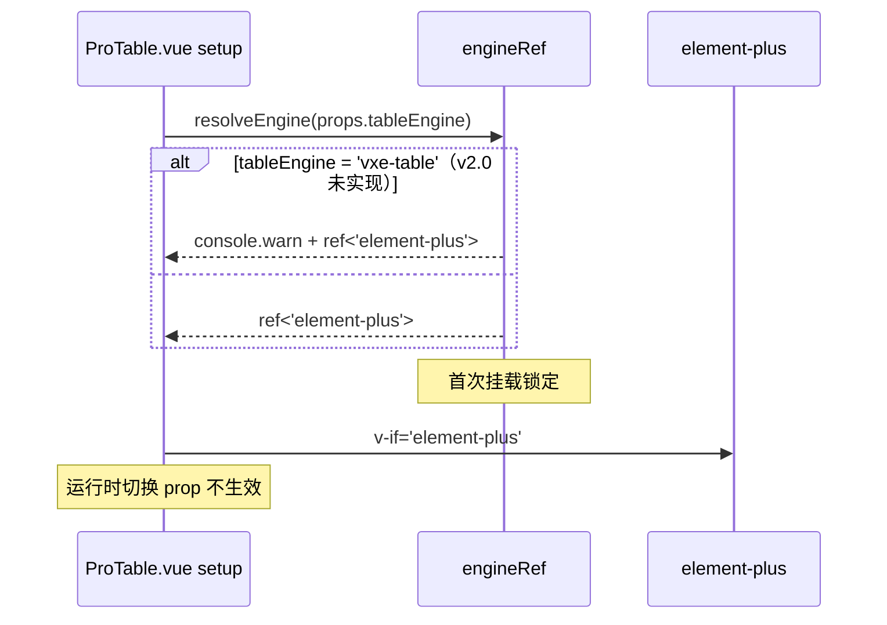

# ProTable 架构文档

> **当前版本**：v3.4（搜索区布局档位下放 + v3.2 已选回显/字段联动）
>
> **v3.4 增量摘要**：
>
> - **searchLayout prop**：新增 `SearchLayoutMode = 'auto' \| 'flat' \| 'collapse' \| 'flat-large' \| 'drawer'` 类型 + ProTableProps.searchLayout prop。SearchForm.vue layoutMode 判定顺序调整为：advanced 字段存在（永远 drawer，保证 advanced 字段可达，优先级最高）> searchLayout 非 auto 强制档位 > 字段数自动判定。真实业务两类场景不适配：① 宽屏页面想平铺更多字段却被强制折叠（字段数 ≠ 页面空间需求）；② searchDisplay 联动使字段数动态变化时档位在 flat/collapse 间跳变（展开/收起按钮时有时无、布局抖动）
>
> ---
>
> **v3.2 增量摘要**：
>
> - **SearchLevel 常量**（types/index.ts）：用 const 对象 + 类型替代纯字符串字面量联合（`'basic'`/`'advanced'`），避免模板拼错 + IDE 自动补全
> - **search 配置 v3.2 扩展**（SearchConfig）：`level`（basic/advanced 层级）/ `debounce`（输入防抖毫秒）/ `searchTrigger`（change/enter）/ `onChange`（字段联动清空）/ `lazyEnum`（字典懒加载）/ `collapsed`（per-field 折叠控制）—— 覆盖中后台多查询条件场景（5-30 个查询条件优雅展示）
> - **showSelectedTags prop**（默认 true）：搜索区与表格之间显示当前生效查询条件 tag，支持单个/全部清除（v3.2 SelectedTags.vue 新增）
> - **expandedStatePersist prop**：展开/收起状态通过 localStorage[`${tableKey}:search-expanded`] 记忆（需 tableKey，未设置忽略）
> - **searchDisplay prop**：字段联动显隐（`(params) => Record<prop, boolean>`），返回 `false` 的字段**彻底隐藏**（不进入主表单也不进入高级筛选抽屉）；纯函数 + reactive 自动追踪依赖
>
> ---
>
> **v3.1 增量摘要**：
>
> - **useAutoHeight**：表格区自动撑满视口剩余高度（实测 DOM 算法 + window resize + ResizeObserver 重算；jsdom 守卫；钳制下限 100px）。`autoHeight: true | { offset }`，virtualized 同开忽略 + warn
> - **useStatePersist**：搜索/分页/排序路由级持久化。localStorage 快照（`${tableKey}:state`）+ sessionStorage alive 标记（beforeunload 清除）—— 路由返回恢复、F5 刷新不恢复。快照经 `initialState` 注入 useTable ref 初值（setup 早期同步，避开 page watcher 双发）
> - **useFullscreen**：全屏状态（CSS fixed 方案，z-index 1500 低于 el-dialog；Esc 退出 flush:'sync'；scope dispose 清监听）
> - **radio 单选列**：el 引擎自绘 ElRadio（ep 无内置）、vxe 引擎映射内置 type='radio'；选中收敛 useTable 统一选中区，多单选 getSelectedRows/clearSelection 同构
> - **reserveSelection**：多选跨页保持一等字段（el 列属性 / vxe checkbox-config.reserve，均 node_modules 运行时代码实证）
> - **cell-format 预设**：`formatter: 'dateTime'|'date'|'time'|'amount'|'percent'|'boolTag'`；`ColumnFormatter<T>` = 函数 | 预设 key；同时修复 formatter 在 el/vxe 引擎分支未接线的遗漏（v3.0.1 仅 v2 分支生效），三引擎统一走 resolveFormatter 解析层
>
> ---
>
> **v3.0.1 增量摘要**：
>
> - **真虚拟化引擎**：虚拟滚动从 v3.0 的"高度容器 + CSS overflow 假虚拟化"切换到 el-table-v2 真虚拟化
> - **新增 ElementTableV2Body**：包装 `<el-table-v2>` + 列 cellRenderer 适配，独立于 v1 引擎分支
> - **强隔离策略**：virtualized 启用时其他能力（行内编辑 / 树形 / 汇总 / 合并 / 拖拽 / **多选列**）一律 warn + 忽略
> - **v2 关键实现决策**：传 table 级 `fixed` prop=true（rigid 布局：列宽精确 = 配置值，总宽超出容器撑出横向滚动条，v1 语义；代价是 flexGrow/minWidth 被源码禁用，剩余空间由适配层 v1 填充算法按 minWidth 比例分配、末列吸收取整余数）；行高走 fixed-size `row-height`（`estimated-row-height` 的 DynamicSizeGrid 按 rowKey 缓存实测高度，会导致密度切换失效）；排序接 `onColumnSort` callback prop + `sortBy` 驱动 SortIcon，翻译为编排层 `sort-change`
> - **vxe-table 引擎回落**：virtualized + tableEngine="vxe-table" 自动回落到 element-plus
> - **useVirtualScroll 升级**：新增 `v2TableConfig` 输出；`VirtualScrollConfig` 扩展 `height` / `width`
> - **渲染分支优先级**：ProTable.vue 模板分支 `virtualized > engine`（虚拟化命中优先于引擎选择）
>
> **完整设计**：[`docs/superpowers/specs/2026-09-15-protable-el-table-v2-design.md`](../../superpowers/specs/2026-09-15-protable-el-table-v2-design.md)
>
> **完整实施计划**：[`docs/superpowers/plans/2026-09-15-protable-el-table-v2-impl.md`](../../superpowers/plans/2026-09-15-protable-el-table-v2-impl.md)
>
> ---
>
> **v3.0 增量摘要**：
>
> - **C1/C2 修复**：resetToDefault 不破坏外部 Ref 响应性 + persist 排除动态 Ref 列
> - **H1/H2/H3 修复**：watch 清理（page/pageSize + proTableEl）+ validateCapabilities 提前到 setup
> - **M 公共抽取**：`_utils/pickDefined.ts`（pickDefined / asConfig / castToRecordArray）
> - **M1-M5**：cloneColumns 拆子函数 + defaultSortParams 泛型 + loose → nonGeneric 重命名 + setRowOrder cast 收敛 + useTableEngineDom composable
> - **L1/L3/L4 优化**：assertValidResponse 上下文 + 命名工程化（isVxeEngine / extendedExpose）+ 模板内联箭头函数提取
>
> **完整改造计划**：[`docs/superpowers/plans/2026-09-14-protable-v3-refactor.md`](../../superpowers/plans/2026-09-14-protable-v3-refactor.md)

## 数据流（state owner = ProTable.vue）



## Composables 依赖

| Composable             | 依赖                                | 输出                                                     |
| ---------------------- | ----------------------------------- | -------------------------------------------------------- |
| `useSearch`            | props.columns（search 配置）        | searchParams / search() / reset()                        |
| `useColumns`           | props.columns + Local               | sortedColumns / allColumns / toggleVisible               |
| `useTable`             | props + useSearch + useColumns      | data / loading / pagination / selectedRows / sortState   |
| `adapters/engine`      | props.tableEngine                   | Ref<TableEngine>（首次挂载锁定）                         |
| **v3.0 新增**          |                                     |                                                          |
| `_utils/pickDefined`   | —                                   | pickDefined / asConfig / castToRecordArray（公共工具）   |
| `useTableEngineDom`    | proTableEl 模板 ref                 | getTbody()（DOM 访问层，v3.0 M5 抽取基础设施）           |
| **v3.1 新增**          |                                     |                                                          |
| `useAutoHeight`        | rootEl + props.autoHeight           | maxHeight（Ref<number \| null>，null 不绑定）            |
| `useStatePersist`      | props.tableKey + props.statePersist | read() 快照 / attach() 写回监听（Local + session alive） |
| `useFullscreen`        | —                                   | isFullscreen / toggleFullscreen / exitFullscreen         |
| `adapters/cell-format` | —                                   | resolveFormatter（函数/预设 key → 可执行格式化函数）     |

## 状态归属

| 状态          | 位置            | 类型        | 持久化                                                                              |
| ------------- | --------------- | ----------- | ----------------------------------------------------------------------------------- |
| 搜索参数      | useSearch       | reactive    | v3.1 可选（statePersist 时经 useStatePersist → Local `${tableKey}:state`）          |
| 表格数据      | useTable        | ref         | 否（按需 fetch）                                                                    |
| 多选/单选选中 | useTable        | ref         | 否（多选跨页保持走 el-table reserve-selection / vxe checkbox-config.reserve）       |
| 列设置        | useColumns      | ref + Local | ✅（Local `${tableKey}:columns`）                                                   |
| 密度          | useTable        | ref         | 否                                                                                  |
| 分页/排序状态 | useTable        | ref         | v3.1 可选（statePersist 时随快照持久化；M2 服务端排序不混入 searchParams，决策 D4） |
| 全屏态        | useFullscreen   | ref         | 否（组件内状态，class 由编排层绑定）                                                |
| 引擎          | adapters/engine | Ref         | 否（首次挂载锁定）                                                                  |

## 引擎切换



## 错误处理

详见 spec §九「错误处理矩阵」13 项场景。核心：

- `useRequest` 内置 AbortController + 三态（loading/error/data）
- `Local.get` 内置 `safeParse` 清脏数据
- vxe-table 引擎 v2.0 未实现：传入时 resolveEngine warn 并回退 element-plus（v2.1 交付）
- `responseAdapter` 返回值结构非法 → console.error + 抛错（useRequest catch 进入 error 态 + requestError 回调，决策 D5）

## 文件清单

```
src/components/ProTable/
├── ProTable.vue                  # 编排层（引擎分发 + 状态 owner）
├── index.ts                      # 统一导出
├── types/index.ts                # 类型定义
├── adapters/
│   ├── engine.ts                 # 引擎工厂（resolveEngine）
│   ├── cell-render.ts            # 单元格内容解析（双引擎共用）
│   └── vxe-column.ts             # ProColumn → VxeColumn 映射（v2.1）
├── composables/                  # 17 个 composables（4 核心 useTable/useSearch/useColumns/
│                                 # useTableCapabilities + 13 能力/引擎/事件：useRowEdit/useRowDrag/
│                                 # useCellSpan/useTreeData/useSummary/useVirtualScroll/useAutoHeight/
│                                 # useStatePersist/useFullscreen/useProTableEvents/useVxeTable/
│                                 # useEngineFallback/useTableEngineDom）
├── components/                   # 13 个子组件 + 双引擎渲染分支：
│                                 # ElementTableBody / VxeTableBody（v2.1）+ ToolbarRenderer /
│                                 # SelectionBar（2026-09-18 工具栏与批量操作条）
├── ProTable.integration.spec.ts  # 集成测试
├── ProTable.engine.spec.ts       # 引擎切换测试（v2.1）
└── __tests__/                    # 其余 .spec.ts
```

## 覆盖率

| 模块        | 测试数 |
| ----------- | ------ |
| useSearch   | 5      |
| useTable    | 13     |
| useColumns  | 5      |
| SearchForm  | 4      |
| TableHeader | 4      |
| ColSetting  | 3      |
