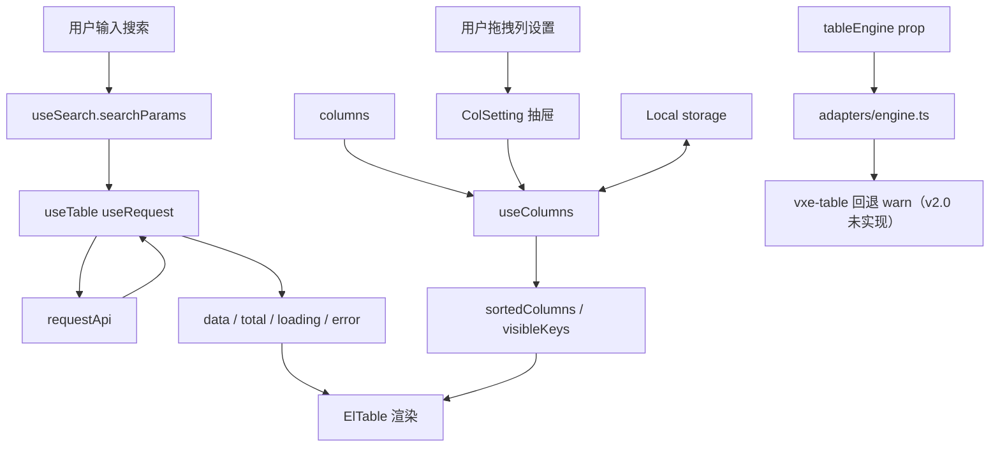
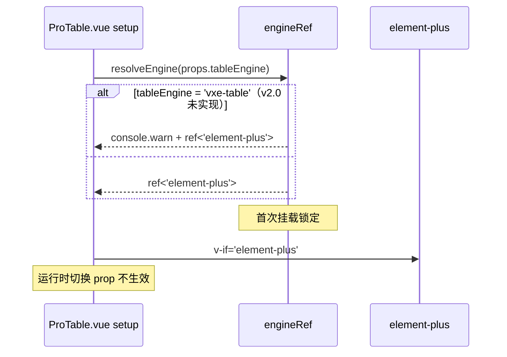

# ProTable 架构文档

## 数据流（state owner = ProTable.vue）



## Composables 依赖

| Composable        | 依赖                           | 输出                                       |
| ----------------- | ------------------------------ | ------------------------------------------ |
| `useSearch`       | props.columns（search 配置）   | searchParams / search() / reset()          |
| `useColumns`      | props.columns + Local          | sortedColumns / allColumns / toggleVisible |
| `useTable`        | props + useSearch + useColumns | data / loading / pagination / selectedRows |
| `adapters/engine` | props.tableEngine              | Ref<TableEngine>（首次挂载锁定）           |

## 状态归属

| 状态     | 位置            | 类型        | 持久化                            |
| -------- | --------------- | ----------- | --------------------------------- |
| 搜索参数 | useSearch       | reactive    | 否                                |
| 表格数据 | useTable        | ref         | 否（按需 fetch）                  |
| 多选选中 | useTable        | ref         | 否（el-table reserve-selection）  |
| 列设置   | useColumns      | ref + Local | ✅（Local `${tableKey}:columns`） |
| 密度     | useTable        | ref         | 否                                |
| 引擎     | adapters/engine | Ref         | 否（首次挂载锁定）                |

## 引擎切换



## 错误处理

详见 spec §九「错误处理矩阵」13 项场景。核心：

- `useRequest` 内置 AbortController + 三态（loading/error/data）
- `Local.get` 内置 `safeParse` 清脏数据
- vxe-table 引擎 v2.0 未实现：传入时 resolveEngine warn 并回退 element-plus（v2.1 交付）

## 文件清单

```
src/components/ProTable/
├── ProTable.vue                  # 编排层
├── index.ts                      # 统一导出
├── types/index.ts                # 类型定义
├── adapters/engine.ts            # 引擎工厂
├── composables/                  # 4 个 composables
├── components/                   # 3 个子组件
└── __tests__/                    # 8 个 .spec.ts
```

## 覆盖率

| 模块        | 测试数 |
| ----------- | ------ |
| useSearch   | 5      |
| useTable    | 6      |
| useColumns  | 5      |
| SearchForm  | 4      |
| TableHeader | 4      |
| ColSetting  | 3      |
