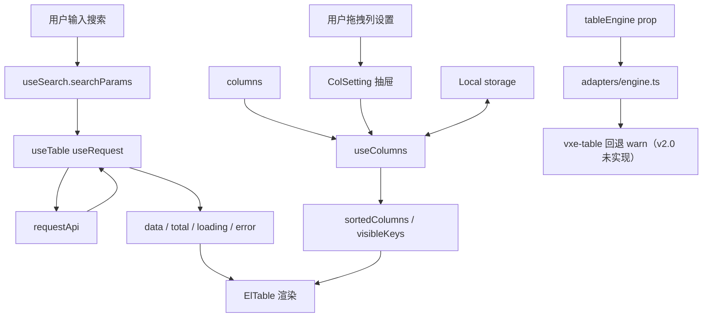
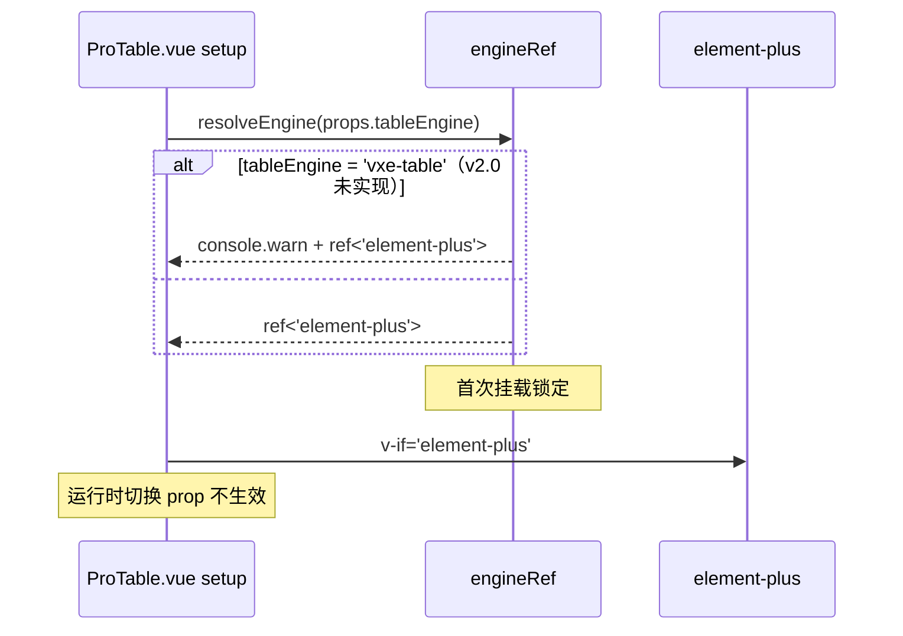

# ProTable 架构文档

> **当前版本**：v3.0.1（v3.0 + 真虚拟化引擎升级）
>
> **v3.0.1 增量摘要**：
>
> - **真虚拟化引擎**：虚拟滚动从 v3.0 的"高度容器 + CSS overflow 假虚拟化"切换到 el-table-v2 真虚拟化
> - **新增 ElementTableV2Body**：包装 `<el-table-v2>` + 列 cellRenderer 适配，独立于 v1 引擎分支
> - **强隔离策略**：virtualized 启用时其他能力（行内编辑 / 树形 / 汇总 / 合并 / 拖拽）一律 warn + 忽略
> - **vxe-table 引擎回落**：virtualized + tableEngine="vxe-table" 自动回落到 element-plus
> - **useVirtualScroll 升级**：新增 `v2TableConfig` 输出；`VirtualScrollConfig` 扩展 `height` / `width`
> - **渲染分支优先级**：ProTable.vue 模板分支 `virtualized > engine`（虚拟化命中优先于引擎选择）
>
> **完整设计**：[`docs/superpowers/specs/2026-09-15-protable-el-table-v2-design.md`](../../superpowers/specs/2026-09-15-protable-el-table-v2-design.md)
>
> **完整实施计划**：[`docs/superpowers/plans/2026-09-15-protable-el-table-v2-impl.md`](../../superpowers/plans/2026-09-15-protable-el-table-v2-impl.md)
>
> ---
>
> **v3.0 增量摘要**：
>
> - **C1/C2 修复**：resetToDefault 不破坏外部 Ref 响应性 + persist 排除动态 Ref 列
> - **H1/H2/H3 修复**：watch 清理（page/pageSize + proTableEl）+ validateCapabilities 提前到 setup
> - **M 公共抽取**：`_utils/pickDefined.ts`（pickDefined / asConfig / castToRecordArray）
> - **M1-M5**：cloneColumns 拆子函数 + defaultSortParams 泛型 + loose → nonGeneric 重命名 + setRowOrder cast 收敛 + useTableEngineDom composable
> - **L1/L3/L4 优化**：assertValidResponse 上下文 + 命名工程化（isVxeEngine / extendedExpose）+ 模板内联箭头函数提取
>
> **完整改造计划**：[`docs/superpowers/plans/2026-09-14-protable-v3-refactor.md`](../../superpowers/plans/2026-09-14-protable-v3-refactor.md)

## 数据流（state owner = ProTable.vue）



## Composables 依赖

| Composable           | 依赖                           | 输出                                                   |
| -------------------- | ------------------------------ | ------------------------------------------------------ |
| `useSearch`          | props.columns（search 配置）   | searchParams / search() / reset()                      |
| `useColumns`         | props.columns + Local          | sortedColumns / allColumns / toggleVisible             |
| `useTable`           | props + useSearch + useColumns | data / loading / pagination / selectedRows / sortState |
| `adapters/engine`    | props.tableEngine              | Ref<TableEngine>（首次挂载锁定）                       |
| **v3.0 新增**        |                                |                                                        |
| `_utils/pickDefined` | —                              | pickDefined / asConfig / castToRecordArray（公共工具） |
| `useTableEngineDom`  | proTableEl 模板 ref            | getTbody()（DOM 访问层，v3.0 M5 抽取基础设施）         |

## 状态归属

| 状态     | 位置            | 类型        | 持久化                                                       |
| -------- | --------------- | ----------- | ------------------------------------------------------------ |
| 搜索参数 | useSearch       | reactive    | 否                                                           |
| 表格数据 | useTable        | ref         | 否（按需 fetch）                                             |
| 多选选中 | useTable        | ref         | 否（el-table reserve-selection）                             |
| 列设置   | useColumns      | ref + Local | ✅（Local `${tableKey}:columns`）                            |
| 密度     | useTable        | ref         | 否                                                           |
| 排序状态 | useTable        | ref         | 否（M2 服务端排序：sortState，不混入 searchParams，决策 D4） |
| 引擎     | adapters/engine | Ref         | 否（首次挂载锁定）                                           |

## 引擎切换



## 错误处理

详见 spec §九「错误处理矩阵」13 项场景。核心：

- `useRequest` 内置 AbortController + 三态（loading/error/data）
- `Local.get` 内置 `safeParse` 清脏数据
- vxe-table 引擎 v2.0 未实现：传入时 resolveEngine warn 并回退 element-plus（v2.1 交付）
- `responseAdapter` 返回值结构非法 → console.error + 抛错（useRequest catch 进入 error 态 + requestError 回调，决策 D5）

## 文件清单

```
src/components/ProTable/
├── ProTable.vue                  # 编排层（引擎分发 + 状态 owner）
├── index.ts                      # 统一导出
├── types/index.ts                # 类型定义
├── adapters/
│   ├── engine.ts                 # 引擎工厂（resolveEngine）
│   ├── cell-render.ts            # 单元格内容解析（双引擎共用）
│   └── vxe-column.ts             # ProColumn → VxeColumn 映射（v2.1）
├── composables/                  # 10 个 composables（useTable/useSearch/useColumns/
│                                 # useRowEdit/useRowDrag/useCellSpan/useTreeData/
│                                 # useTableCapabilities/useVxeTable）
├── components/                   # 6 个子组件 + 双引擎渲染分支：
│                                 # ElementTableBody（el 引擎）/ VxeTableBody（vxe 引擎，v2.1）
├── ProTable.integration.spec.ts  # 集成测试
├── ProTable.engine.spec.ts       # 引擎切换测试（v2.1）
└── __tests__/                    # 其余 .spec.ts
```

## 覆盖率

| 模块        | 测试数 |
| ----------- | ------ |
| useSearch   | 5      |
| useTable    | 13     |
| useColumns  | 5      |
| SearchForm  | 4      |
| TableHeader | 4      |
| ColSetting  | 3      |
